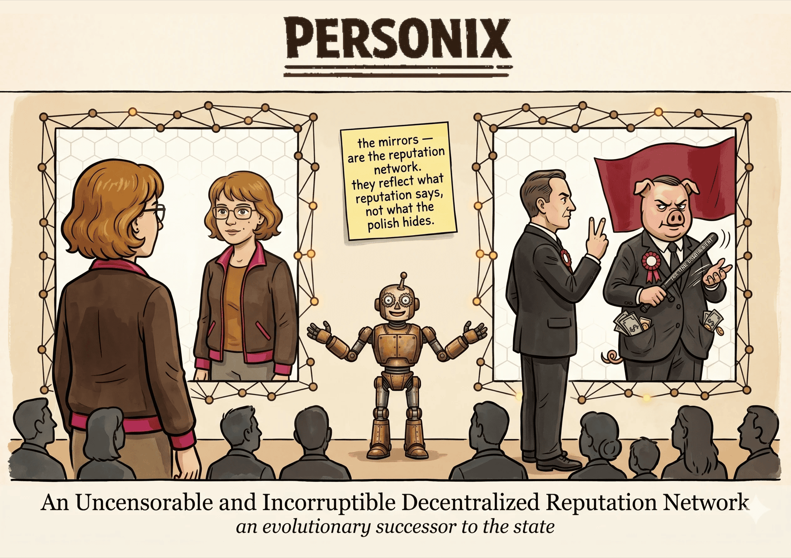
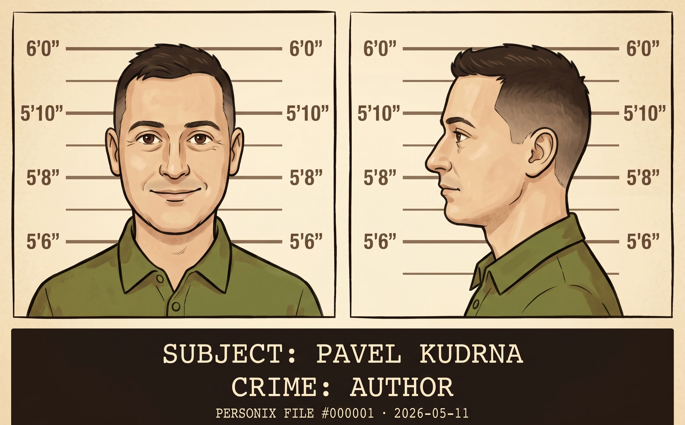

---

## 📘 Pamphlet — accessible edition

> Illustrated, narrative form. Recommended for first read.

**English**
- ↓ [Download PDF](release/pamphlet-v6-en.pdf) — ~41 MB
- ↓ [Download EPUB](release/pamphlet-v6-en.epub) — ~38 MB

**Čeština** *(DRAFT — recenzní verze, watermarkovaná)*
- ↓ [Stáhnout PDF](release/pamphlet-v6-cz-DRAFT.pdf) — ~41 MB
- ↓ [Stáhnout EPUB](release/pamphlet-v6-cz-DRAFT.epub) — ~38 MB

> Finální CZ vydání bude publikováno po dokončení recenzního kola. Recenzenti dostávají vlastní link emailem.

## 📄 Whitepaper — academic article

> Dense, formal argument. Optional supplementary read. Archived on Zenodo with permanent DOI: [10.5281/zenodo.20366216](https://doi.org/10.5281/zenodo.20366216).

**English**
- ↓ [Download PDF](release/Personix-Whitepaper-EN.pdf) — ~106 KB
- ↓ [Download EPUB](release/whitepaper-en.epub) — ~35 KB

**Čeština**
- ↓ [Stáhnout PDF](release/Personix-Whitepaper-CZ.pdf) — ~118 KB
- 🎧 [Audio narration (M4A)](release/Personix-Whitepaper-CZ-narration.m4a) — ~17 MB

## 🛠️ Reproducibility

LaTeX and Markdown sources for both the pamphlet and the whitepaper live under [`docs/`](docs/). Build scripts produce the PDFs and EPUBs in [`release/`](release/) from source.

## 💝 Support the project

Personix is funded by readers like you. The preferred channels are small contributions via Bitcoin Lightning or on-chain BTC.

<strong>Bitcoin on-chain</strong> 
<code>bc1q7cctdz6r026dgy06ul94eygg49ujtxnrq5czaj</code>

 
 

<strong>Bitcoin Lightning</strong> 
<code>LNURL1DP68GURN8GHJ7AMPD3KX2AR0VEEKZAR0WD5XJTNRDAKJ7TNHV4KXCTTTDEHHWM30D3H82UNVWQHHXMNP0FA8JMTPVD5XJMN9XUERX55QRQK</code>

 
 

The QR codes above are **my personal channels** — contributions go directly to me and fund further writing, the social experiment / simulation, and outreach.

 

## ⚠️ Where the money goes — and where it does not

Other legitimate channels: **author's editions of this book** (QR codes printed in authorised copies) and [**personix.org**](https://personix.org) or its Tor onion mirror — where the *Personix Foundation* collects for the activities described there (foundation funds kept separate from personal funds).

**Anything advertised elsewhere — substituted addresses in reprints, lookalike domains, social media "raising for Personix," fundraisers not tied to either of the above — is most likely fraud. We deliberately avoid the cryptocurrency market and its participants.**

## 📢 Campaigns & fundraisers

Active crowdfunding and promotional campaigns (Startovač, Hithit, Indiegogo, and similar platforms) are announced exclusively here and on personix.org. Anywhere else is not us.

> *No active campaigns at this time.*

## 🕊️ Warrant canary

As of **2026-05-11**, the Personix project authors have **not** received any:

- National security letters or equivalent
- Gag orders requiring silence about a legal request
- Subpoenas, search warrants, or court orders for project data
- Government demands to insert backdoors, surveillance code, or alter content

No party has been compelled to disclose information about the project, its authors, or its contributors.

This canary is renewed periodically. **Absence of an updated canary should be interpreted as a signal that the author has become subject to some form of state compulsion** and cannot say so directly.

## 📬 Contact

| | |
|---|---|
| **Email** | [personix@personix.org](mailto:personix@personix.org) |
| **Web** | [https://personix.org](https://personix.org) |
| **GitHub** | [github.com/personix-org/personix](https://github.com/personix-org/personix) |

---

Texts, illustrations, and supporting code © 2025–2026 Pavel Kudrna, licensed under [**CC BY-SA 4.0**](LICENSE).
Reserved (not under CC BY-SA): the **Personix** name and wordmark, the cover artwork, and the donation channels.
