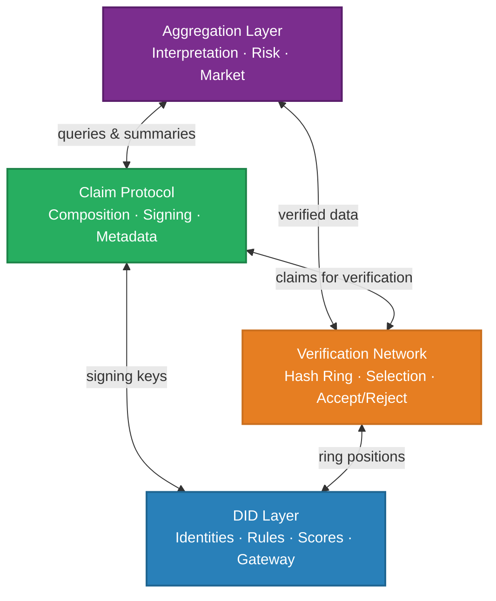
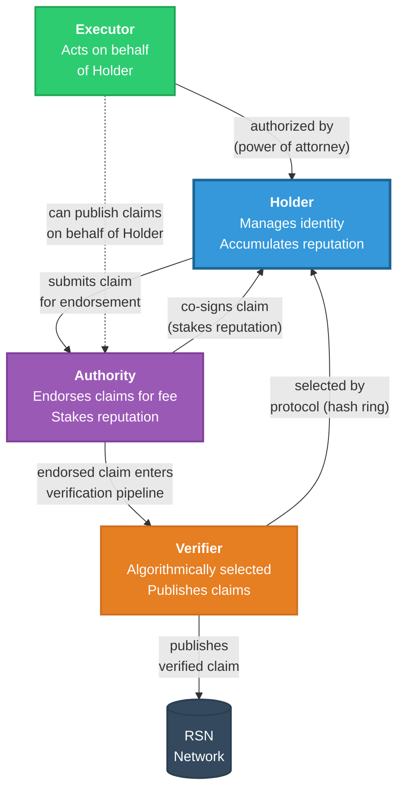
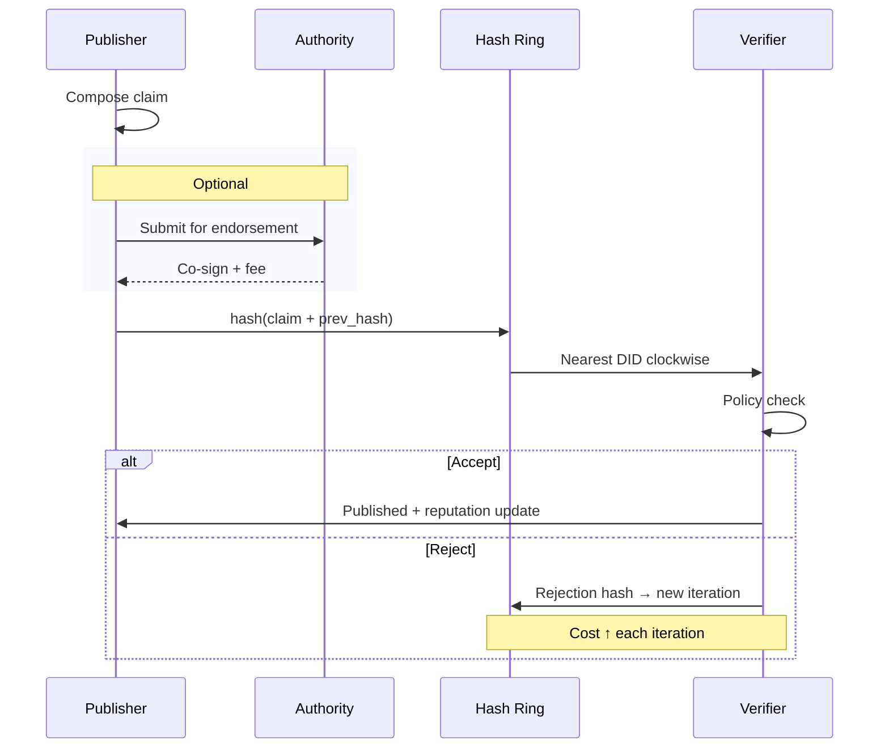
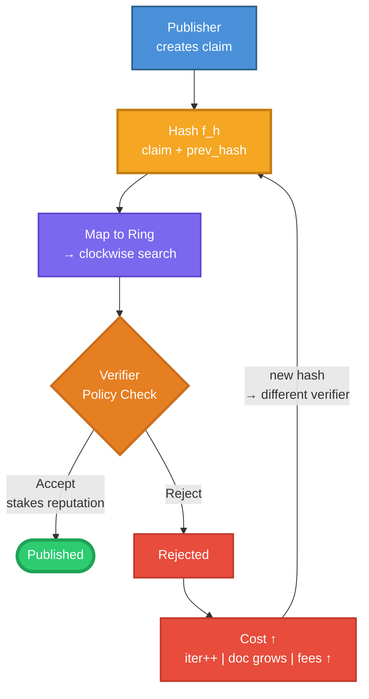
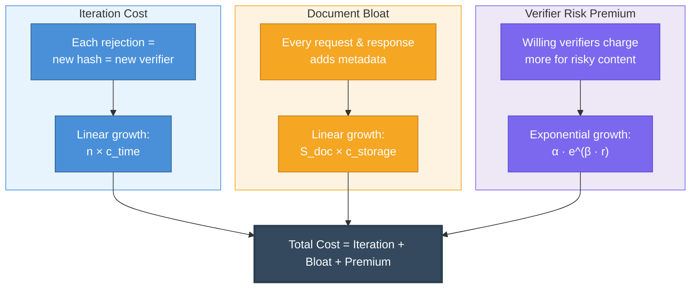
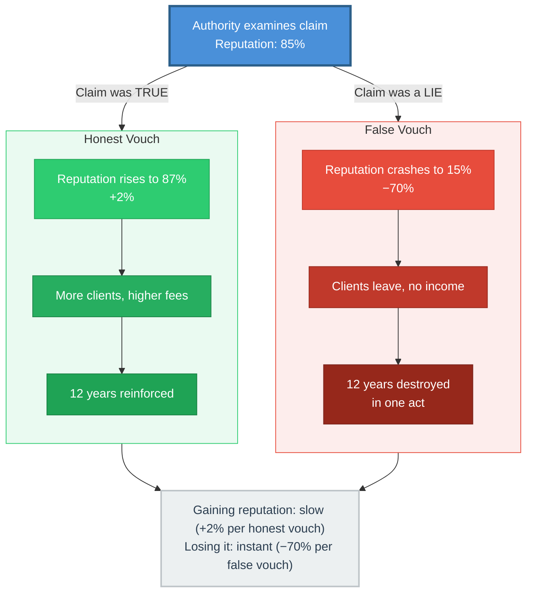
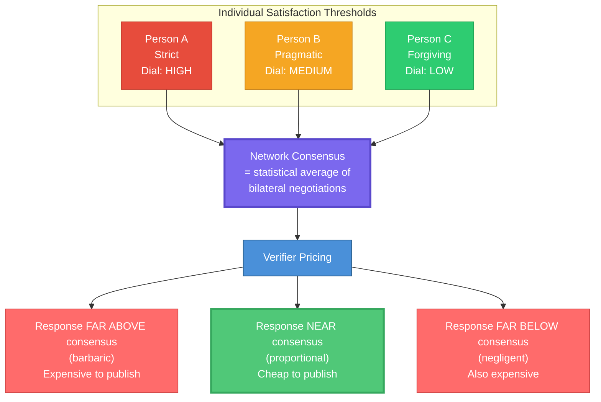
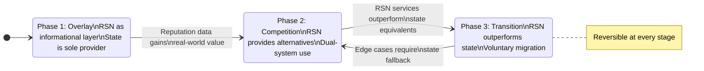

# Decentralizovaná reputační síť: Rámec pro dobrovolnou organizaci společnosti

**Pavel Kudrna**
Prague, Czechia

**Draft v1 — březen 2026**

---

<!-- \begin{abstract} -->

## Abstrakt

Centralizované instituce správy — soudy, rejstříky, regulační orgány — trpí strukturálním nesouladem mezi náklady na přístup ke spravedlnosti a rozsahem sporů, které mají řešit. Když náklady na vymáhání práva překročí hodnotu samotného práva, institucionální rámec přestává fungovat jako věrohodný odstrašující prostředek proti protiprávnímu jednání. Navrhujeme reputační sociální síť (Reputation Social Network, RSN): decentralizovanou, necenzurovatelnou a nezkorumpovatelnou komunikační vrstvu postavenou na decentralizovaných identifikátorech (Decentralized Identifiers, DID), která umožňuje pseudonymním účastníkům publikovat, ověřovat a konzumovat reputační informace o chování v reálném světě. Architektura je navržena kolem dvou rovnocenných obranných vlastností: *necenzurovatelnosti* — síť nelze potlačit zvenčí — a *nezkorumpovatelnosti* — síť nelze zajmout zevnitř. Jádro mechanismu spočívá na třech konstrukčních principech: (1) asymetrická nákladová struktura, kde čtení reputačních dat je levné, ale zápis vyžaduje ověřitelné úsilí, čímž se podvodné záznamy stávají ekonomicky neúnosnými; (2) nedeterministický protokol výběru ověřovatelů založený na konzistentním hashování, který oceňuje radikální nebo nepodložené tvrzení prostřednictvím eskalujících iteračních nákladů; a (3) tržně řízený model reputačních autorit, v němž soukromí ověřovatelé sázejí svou nashromážděnou reputaci na přesnost tvrzení, která endorsují. Ukazujeme, že tato architektura vytváří emergentní konsenzus bez centrální koordinace, přirozeně motivuje proti pomlouvačnému nebo podvodnému chování a umožňuje postupnou, reverzibilní migrační cestu od stávajících státem spravovaných systémů k alternativě založené na zásluhách. Navrhovaný systém nevyžaduje zrušení existujících institucí; místo toho buduje paralelní vrstvu, která činí centralizované prostředníky postupně zbytečnými prostřednictvím dobrovolného přijetí.

<!-- \end{abstract} -->

---

<!-- \section{Introduction} -->

## 1. Úvod

### 1.1 Problém centralizované důvěry

Moderní správa věcí veřejných spočívá na základním předpokladu: že centralizované instituce dokáží zprostředkovat důvěru mezi cizími lidmi ve velkém měřítku. Soudy rozhodují spory. Rejstříky osvědčují vlastnictví. Regulační orgány vynucují standardy. Tyto instituce byly navrženy v době, kdy informace byly vzácné, komunikace pomalá a delegování pravomocí na centrální orgán bylo jediným proveditelným koordinačním mechanismem.

Tento předpoklad selhává, když náklady na institucionální zprostředkování převýší hodnotu sporu. Uvažme nájemce, který zjistí, že pronajatý byt postrádá zákonem požadovanou revizní zprávu elektroinstalace — stav, který bezprostředně ohrožuje život. Nájemcovo právní oprávnění odstoupit od smlouvy je jednoznačné. Avšak náklady na vynucení tohoto práva prostřednictvím soudního systému — odměny advokátů, zákonné čekací lhůty, sazebníky, které nahrazují jen zlomek skutečných právních nákladů — převyšují peněžní hodnotu kauce a dlužného odškodného. Racionální odpovědí, a empiricky nejčastější, je ztrátu absorbovat a odejít [1].

Nejedná se o patologický okrajový případ. Je to standardní zkušenost u významné třídy sporů, v nichž je újma reálná, ale finanční sázka spadá pod práh, při němž se institucionální vynucování stává ekonomicky racionálním. Geometrie tohoto selhání je přímočará: strana, která způsobí škodu, nečelí žádnému věrohodnému odstrašení, pokud náklady na prokázání škody překračují škodu samotnou. Institucionální rámec, navržený k ochraně, se stává štítem pro protiprávní jednání prostřednictvím vlastních provozních nákladů.

Problém přesahuje řešení sporů. Stavební povolení jsou zdržována úředníky, jejichž estetické preference převažují nad souhlasem komunity [2]. Dědická řízení účtují poplatky úměrné hodnotě pozůstalosti, nikoli složitosti případu, a nutí pozůstalé rodiny platit za byrokratické potvrzení faktů, které jsou všem stranám již známy. Vzdělávací alternativy k selhávajícím institucím musejí být hodnoceny a schvalovány těmi samými institucemi, které mají nahradit. V každém případě je vzorec identický: centralizovaný prostředník extrahuje rentu z procesu, který uměle zkomplikoval, zatímco jednotlivci nejblíže problému — sousedé, rodinní příslušníci, komunity — již identifikovali funkční řešení, která systém odmítá uznat.

### 1.2 Proč stávající řešení nedostačují

K řešení omezení centralizované důvěry bylo navrženo několik přístupů.

**Rámce decentralizované identity (DID)** [3, 4] poskytují kryptografické mechanismy pro sebevládní správu identity (Self-Sovereign Identity). Specifikace W3C DID Core [3] definuje standard pro decentralizované identifikátory, které lze vytvářet, resolvovat a spravovat bez centrálního rejstříku. Stávající implementace DID se však zaměřují primárně na ověřování identity a vydávání pověření — schopnost prokázat, *kdo jste* — aniž by řešily širší otázku, *jak se chováte*. DID, který osvědčuje vaše vzdělání, neříká nic o tom, zda dodržujete smlouvy.

**Soulbound tokeny (SBT)** [5] rozšiřují model identity navržením nepřenositelných tokenů, které kódují sociální vztahy a závazky. Ačkoli SBT zachycují poznatek, že reputace je nepřenositelná, spoléhají na blockchainovou infrastrukturu, která přináší omezení škálovatelnosti a energetické náklady neúměrné problémům sociální koordinace, které mají řešit. Model SBT navíc neřeší ekonomické pobídky řídící zadávání informací — otázku, kdo platí a kolik za zaznamenání tvrzení o chování jiné strany.

**Decentralizované autonomní organizace (Decentralized Autonomous Organizations, DAO)** [6] implementují správu prostřednictvím chytrých kontraktů a hlasování váženého tokeny. DAO prokázaly, že kolektivní rozhodování bez centrální autority je technicky proveditelné. Avšak správa vážená tokeny replikuje plutokratickou dynamiku: vliv je úměrný kapitálu, nikoli prokázané kompetenci nebo behaviorální historii. Mechanismy kvadratického hlasování (Quadratic Voting) [7] tento problém částečně zmírňují, ale zavádějí složitost, která omezuje praktické přijetí.

**Tradiční reputační systémy** — kreditní skóre, recenze na Yelpu, akademické citace — demonstrují, že reputační informace mají ekonomickou hodnotu. Tyto systémy jsou však centrálně spravované, cenzurovatelné a netransparentní. Kreditní kancelář může jednostranně zničit finanční přístup člověka. Platforma může smazat recenze, které jsou v rozporu s jejími komerčními zájmy. Žádný existující systém nekombinuje vlastnosti požadované pro infrastrukturu důvěry celospolečenského rozsahu: decentralizaci, odolnost vůči cenzuře, pseudonymitu, ověřitelné náklady vstupu a emergentní konsenzus.

### 1.3 Náš příspěvek

Předkládáme následující příspěvky:

1. Definujeme **reputační sociální síť (RSN)**, decentralizovaný komunikační protokol, který rozšiřuje rámec DID o podporu bilaterální výměny reputačních informací mezi pseudonymními účastníky.

2. Navrhujeme **nedeterministický protokol výběru ověřovatelů** založený na konzistentním hashování, který algoritmicky přiděluje odpovědnost za ověřování a zajišťuje, že žádný jednotlivý subjekt nekontroluje publikaci reputačních informací.

3. Zavádíme **princip drahého radikalismu** (Expensive Radicalism Principle), mechanismus designu, který oceňuje publikaci tvrzení podle jejich vzdálenosti od síťového konsenzu prostřednictvím tří kumulativních nákladových kanálů: iteračních nákladů, narůstání objemu dokumentu a rizikové přirážky ověřovatelů.

4. Popisujeme **model reputační autority** (Reputable Authority), v němž soukromé ověřovací služby sázejí svou nashromážděnou reputaci na přesnost tvrzení, která endorsují, čímž vytvářejí asymetrické pobídky, kde náklady na endorsování nepravdy katastroficky převyšují výnosy z endorsování pravdy. Tato asymetrie — pomalé hromadění, rychlé ničení — je základním kamenem *nezkorumpovatelnosti* systému: podplatit autoritu je strategie striktně dominovaná poctivou praxí, protože jeden úspěšný úplatek zničí více reputačního kapitálu, než jakákoli reálná odměna může obnovit.

5. Navrhujeme **postupnou migrační cestu** od stávajících státem spravovaných systémů k RSN prostřednictvím paralelní fiskální infrastruktury — zjednodušeného zdanění, elektronické evidence výdajů a občany řízeného přidělování daní — která vytváří konkurenční tlak, aniž by vyžadovala institucionální zrušení.

### 1.4 Struktura článku

Sekce 2 stanovuje konstrukční principy, které omezují architekturu systému. Sekce 3 poskytuje přehled RSN a jejích komponent na vysoké úrovni. Sekce 4 popisuje model decentralizované identity a životní cyklus tvrzení. Sekce 5 podrobně rozebírá protokol ověřování a propagace informací. Sekce 6 analyzuje mechanismy reputace a hodnocení rizik. Sekce 7 se zabývá formováním konsenzu a řešením sporů. Sekce 8 představuje ekonomický model a strukturu pobídek. Sekce 9 popisuje navrhovanou migrační cestu od stávajících systémů. Sekce 10 poskytuje bezpečnostní analýzu známých útočných vektorů. Sekce 11 pojednává o aspektech ochrany soukromí. Sekce 12 mapuje související práce. Sekce 13 přiznává omezení a otevřené otázky. Sekce 14 uzavírá.

---

<!-- \section{Design Principles} -->

## 2. Konstrukční principy

Architektura RSN je omezena pěti konstrukčními principy odvozenými z analýzy toho, proč předchozí pokusy o společenskou koordinaci selhaly. Tyto principy jsou nepřekročitelné — jakákoli implementace, která je porušuje, je mimo rozsah tohoto návrhu.

### 2.1 Kontinuita a evoluce

Systém musí koexistovat se stávajícími institucemi během přechodného období neurčité délky. Nevyžaduje zrušení, narušení ani nahrazení jakékoli existující struktury. Místo toho buduje paralelní infrastrukturu, která se stává postupně atraktivnější prostřednictvím konkurenční výhody. Metaforou je most vybudovaný vedle stávající přívozu: přívoz není zakázán, ale přijetí se přirozeně přesouvá k efektivnější variantě.

Tento princip má zásadní důsledek: přechod musí být **reverzibilní v každé fázi**. Pokud nový systém nedokáže poskytovat lepší výsledky, účastníci se mohou vrátit ke stávajícímu institucionálnímu rámci bez ztráty. Nevratné přechody — revoluce — nesou katastrofální riziko nevýhod a jsou záměrně vyloučeny.

### 2.2 Dobrovolnost a odpovědnost

Účast v RSN je dobrovolná. Žádný jednotlivec není nucen vytvořit DID, publikovat tvrzení ani konzumovat reputační data. Dobrovolnost je však spojena s odpovědností: účastník, který převezme kontrolu nad institucionální funkcí (např. řešení sporů, vynucování smluv), současně přebírá povinnosti, které ji doprovázejí. Neexistují žádná „pozitivní práva" — žádný nárok na služby, které účastník nepomohl vybudovat nebo financovat.

Toto propojení je analogické přechodu ze zaměstnání na živnostenské podnikání. Osoba samostatně výdělečně činná získává autonomii, ale vzdává se záruky fixního platu. RSN nabízí analogickou směnu: větší kontrola nad institucionálními interakcemi, spárovaná s větší expozicí důsledkům.

### 2.3 Diverzita a kulturní neutralita

Systém musí fungovat napříč kulturními, právními a politickými hranicemi, aniž by kódoval normativní předpoklady jakékoli konkrétní jurisdikce. Konsenzus vzniká z bilaterálních interakcí mezi účastníky, nikoli z přednastavených pravidel vnucených tvůrci systému. Co představuje „přiměřený" trest za porušení smlouvy, se může lišit mezi komunitami, a systém musí tuto variabilitu pojmout, aniž by se fragmentoval.

### 2.4 Odolnost: necenzurovatelnost a nezkorumpovatelnost

Systém musí odolat potlačení ze strany státních protivníků. Náklady na cenzurování sítě musí převýšit náklady na její tolerování. Tento princip stanovuje minimální laťku pro technickou architekturu: žádný jediný bod selhání, žádná centralizovaná infrastruktura, kterou lze zabavit nebo odstavit, a komunikační kanály, které obcházejí cenzuru.

Eskalační žebříček pro státního protivníka je: blokovat konkrétní webové stránky (poraženo zrcadly a VPN), zakázat šifrování (poraženo steganografií), odstavit internet (ekonomicky sebezničující) nebo nastolit plný totalitarismus (v většině režimů politicky neudržitelný). Systém musí být navržen tak, aby jej mohla potlačit pouze poslední možnost — za zničující politické a ekonomické náklady.

Odolnost má však dvě tváře. *Necenzurovatelnost* chrání síť před vnějším potlačením — státy, poskytovatelé připojení, zabavení infrastruktury. *Nezkorumpovatelnost* ji chrání před vnitřním zajetím — úplatky, donucení autorit, kolize verifikátorů. Systém, který je pouze necenzurovatelný, může být stejně přeměněn ve stroj na lži kýmkoli, kdo si koupí jeho nejhlasitější hlasy; systém, který je pouze nezkorumpovatelný, může být stejně umlčen dostatečně odhodlaným státem. Obě vlastnosti jsou nosné a zbytek tohoto článku s nimi zachází jako s rovnocennými designovými omezeními.

### 2.5 Nezkorumpovatelnost

Pokud se sekce 2.4 ptá, zda lze síť *umlčet*, tato sekce se ptá, zda ji lze *obrátit*. Necenzurovatelný systém, který je nicméně zajat zevnitř — jehož autority lze podplatit, jehož verifikátoři mohou být donuceni, jehož veřejná pravidla lze potichu porušovat — není infrastrukturou spravedlnosti; je to pračka lží. Nezkorumpovatelnost proto považujeme za designovou vlastnost rovnocennou s necenzurovatelností.

Nezkorumpovatelnost nepovažujeme za výstup jediného vynucovacího mechanismu, ale za systémovou vlastnost, která vzniká ze **souhry několika designových principů současně**. Hlavními z nich jsou vzájemnost svobody a odpovědnosti (§2.2) — každý účastník je svobodný jednat podle své vlastní policy, ale neoddělitelně zavázán ji zveřejnit a nechat se podle ní soudit — a neomezené právo kteréhokoli účastníka publikovat komentář o kterémkoli jiném, bez licencované třídy komentátorů a bez platformového strážce brány. Další vlastnosti protokolu, detailně analyzované v následujících sekcích, směřují stejným směrem. Tři mechanismy uvedené níže jsou nejbezprostředněji čitelnými přispěvateli, ale nejsou vyčerpávající; seznam je otevřený.

Říkáme, že RSN je *nezkorumpovatelná* v následujícím ekonomickém smyslu: žádná strategie dostupná vnitřnímu aktérovi — držiteli (Holder), autoritě, verifikátorovi ani jakékoli jejich koalici — nepřináší kladnou očekávanou hodnotu skrze lhaní, přijímání úplatků nebo zajetí role. Korupce není zakázána protokolem; je oceněna výše než jakákoli dosažitelná odměna. Podstatné je, že žádný jednotlivý pilíř tuto zátěž nenese sám; nezkorumpovatelnost je to, co zbývá, když všechny vzájemně se posilující tlaky designu selžou být obejity současně.

Tři z nejbezprostředněji čitelných vynucovacích mechanismů, každý detailně analyzovaný později:

1. **Nepředvídatelný cíl.** Výběr verifikátora je nedeterministický (§5.2). Protivník si nemůže dopředu koupit ochotu konkrétního verifikátora, protože ani jedna strana dopředu neví, čí ochota bude potřeba.

2. **Asymetrická reputační páka.** Reputace se hromadí pomalu a hroutí se katastrofálně (§6.1, §6.2). Pro jakýkoli úplatek *b* a jakoukoli roli s nashromážděnou reputací *R*, pravděpodobností odhalení *p* a faktorem ztráty reputace λ ≈ 0.7 musí platit podmínka *b* > *pλR*, aby byla korupce racionální — a *R* roste bez hranic, zatímco *b* nemůže.

3. **Veřejný slib.** Deklarovaná pravidla (§4.1) převádějí soukromé chování na veřejně auditovatelný závazek. Každá odchylka je *publikovatelným tvrzením*; penalizace pokrytectví (§8.1) činí neodhalené porušení jediným životaschopným způsobem porušení — a pseudonymita ho neposkytuje.

4. **Asymetrie nákladů na útok mezi hierarchií a meshem.** Náklady na ovládnutí hierarchické instituce se přibližně rovnají nákladům na ovládnutí jejího vrcholu: jeden dobře umístěný úplatek, jeden zkompromitovaný ministr, jeden zajatý regulátor — a celý řetězec velení pod ním poslechne. Náklady škálují zhruba s hloubkou pyramidy — tedy pomalu. V plochém meshi nezávislých peerů žádný takový vrchol neexistuje; aby útočník ohnul systém, musel by zkorumpovat supervětšinu vzájemně nekoordinovaných účastníků, z nichž každý má v sázce vlastní reputaci a vlastní publikovanou policy, proti které by lhal. Náklady na úspěšný útok rostou s velikostí meshe — prakticky dost rychle na to, aby překročily rozpočet jakéhokoli realistického útočníka dávno předtím, než by dosáhly většinového prahu. V hierarchiích je korupce levná; v meshi je levnější *nekorumpovat*. Není to morální tvrzení o účastnících — je to aritmetické tvrzení o topologii.

Necenzurovatelnost a nezkorumpovatelnost jsou dvě zdi téže místnosti. První nepouští dovnitř stát; druhá nepouští dovnitř kartel. Zbytek tohoto článku s oběma zachází jako s nevyjednatelnými.

### 2.6 Konsenzus a vynucování

Systém musí obsahovat vestavěný mechanismus pro vyjednávání pravidel a represivní komponentu pro jejich vynucování. Nejedná se o utopický návrh, v němž všichni účastníci jednají v dobré víře. Design explicitně zahrnuje lidské sklony k malichernosti, zlovůli, závisti a touze po odplatě. Tyto vlastnosti nejsou považovány za vady, které je třeba potlačit, ale za nosné prvky sociální architektury — „cihly", z nichž lze vystavět stabilní zeď, je-li „malta" (design systému) správně naformulována.

Vynucovací mechanismus operuje prostřednictvím ekonomických pobídek, nikoli donucovací autority. Protiprávní jednání není zakázáno; je oceněno. Náklady antisociálního chování eskalují nelineárně, čímž vytvářejí přirozený odstrašující prostředek bez nutnosti monopolu na legitimní násilí.

---

<!-- \section{System Overview} -->

## 3. Přehled systému

### 3.1 Reputační sociální síť

Reputační sociální síť (RSN) je decentralizovaná peer-to-peer komunikační vrstva, v níž účastníci vyměňují ověřitelné informace o chování v reálném světě. Koncepčně je analogická recenzní platformě — „Yelp pro mezilidské vztahy" — avšak s několika zásadními odlišnostmi:

- **Decentralizovaná a necenzurovatelná.** Žádný centrální server, žádný jediný provozovatel, žádný vypínač.
- **Nezkorumpovatelná z konstrukce.** Žádný fixní verifikátor, kterého by šlo podplatit, žádná autorita, které by se vyplatilo lhát, žádné deklarované pravidlo, které by se dalo potichu porušit. Korupce není zakázána — je oceněna výše než jakákoli dosažitelná odměna.
- **Pseudonymní.** Účastníci interagují prostřednictvím decentralizovaných identifikátorů (DID), které nejsou inherentně provázány s právními identitami.
- **Asymetrická nákladová struktura.** Čtení reputačních dat je levné. Zápis — publikování nového tvrzení o jiné straně — vyžaduje ověřitelné vynaložení času, energie a peněz.
- **Ověřitelná.** Tvrzení jsou kryptograficky podepsána, algoritmicky ověřena a trvale zaznamenána.

Klíčový poznatek spočívá v tom, že reputační systém nabývá hodnoty úměrně nákladům na vložení nepravdivých informací. Když je publikování tvrzení zdarma (jako na sociálních sítích), systém se plní šumem. Když je publikování tvrzení drahé a ověřitelné, přežívající informace jsou nepřiměřeně přesné — nikoli proto, že účastníci jsou poctiví, ale proto, že nepoctivost je vytlačena z trhu cenou.

### 3.2 Architektonické komponenty

RSN sestává ze čtyř primárních komponent:

1. **Vrstva DID.** Každý účastník drží jeden nebo více DID v souladu se specifikací W3C DID Core [3], rozšířenou o RSN-specifické vlastnosti včetně deklarovaných behaviorálních pravidel, reputačních metadat a informací o síťovém směrování.

2. **Protokol tvrzení (Claim Protocol).** Strukturovaný formát pro publikování assertions o událostech reálného světa — negativních (porušení smlouvy, důkazy o protiprávním jednání) i pozitivních (splněné závazky, přijatá nápravná opatření). Každé tvrzení je podepsaný dokument s definovanými poli, požadavky na ověření a metadaty nákladů.

3. **Ověřovací síť (Verification Network).** Decentralizovaný protokol pro přidělování ověřovatelů k příchozím tvrzením pomocí konzistentního hashování a nedeterministického výběru. Ověřovatelé sázejí vlastní reputaci na přesnost tvrzení, která endorsují.

4. **Vrstva agregace reputace (Reputation Aggregation Layer).** Sada služeb — potenciálně nabízených konkurujícími tržními účastníky — které konzumují surová data tvrzení a produkují lidsky čitelné reputační souhrny, hodnocení rizik a informace pro podporu rozhodování.

*Obrázek 1: Architektura RSN — čtyřvrstvá hierarchie komponent a mezivrstevní komunikace.*

### 3.3 Role účastníků

DID v RSN může zastávat jednu nebo více ze čtyř rolí:

- **Držitel (Holder).** Vlastník DID, který spravuje svou identitu, deklaruje behaviorální pravidla a akumuluje reputaci.
- **Vykonavatel (Executor).** Strana oprávněná jednat jménem Držitele — analogicky k plné moci.
- **Autorita (Authority).** DID, který poskytuje ověřovací, arbitrážní nebo endorsační služby za poplatek, přičemž sází vlastní reputaci na kvalitu své práce.
- **Ověřovatel (Verifier).** DID algoritmicky vybraný ověřovacím protokolem k přezkoumání a publikaci konkrétního tvrzení.

Tyto role se vzájemně nevylučují. Jediný DID může současně držet vlastní reputaci, vykonávat akce jménem jiného Držitele, poskytovat služby Autority a sloužit jako algoritmicky vybraný Ověřovatel pro příchozí tvrzení.

---

<!-- \section{Decentralized Identity Model} -->

## 4. Model decentralizované identity

### 4.1 DID se speciálními vlastnostmi

RSN rozšiřuje specifikaci W3C DID Core [3] o vlastnosti specifické pro výměnu reputačních informací. Každý DID dokument zahrnuje:

- **Deklarovaná pravidla (Declared Rules).** Strojově čitelná specifikace behaviorálních pravidel, k jejichž dodržování se Držitel zavazuje. Příklady zahrnují záruky dodání („dodání do 30 dnů"), závazky k řešení sporů („spory vyřešeny do jednoho týdne") a zásady nakládání s daty („žádný přeprodej zákaznických dat"). Deklarovaná pravidla jsou veřejná a ověřitelná — jakýkoli rozpor mezi deklarovanými pravidly a pozorovaným chováním představuje publikovatelné tvrzení.

- **Reputační metadata (Reputation Metadata).** Agregované skóre odrážející behaviorální historii Držitele, vypočtené z úhrnu ověřených tvrzení přiřazených k danému DID. Skóre není centrálně vypočítáváno; každá konzumující strana může na surová data tvrzení aplikovat vlastní agregační funkci.

- **Síťové směrování (Network Routing).** Skutečná síťová adresa DID (onion gateway) je oddělena od jeho identifikátoru a je měnitelná. Držitelé mohou přesměrovat směrování podepsáním nové verze DID dokumentu. Toto oddělení zajišťuje, že pozice DID na konzistentním hashovacím kruhu (používaném pro výběr ověřovatelů) zůstává stabilní, i když se síťové umístění Držitele změní.

### 4.2 Čtyři role DID

Čtyři role popsané v sekci 3.3 interagují prostřednictvím definovaného životního cyklu:

*Obrázek 2: Čtyři role DID a jejich interakce. Role se vzájemně nevylučují.*

- **Držitel** publikuje tvrzení o událostech, jichž byl svědkem nebo které zažil. Tvrzení vstupuje do ověřovacího řetězce.
- **Vykonavatel** může publikovat tvrzení jménem Držitele na základě kryptografické autorizace.
- **Autorita** přezkoumává tvrzení předložená k endorsaci a, je-li přesvědčena o jejich věrohodnosti, sází svou reputaci spolupodepsáním tvrzení. Autorita účtuje poplatek úměrný vnímanému riziku tvrzení.
- **Ověřovatel** je algoritmicky vybrán protokolem konzistentního hashování (sekce 5.2) k přezkoumání a publikaci tvrzení do sítě. Ověřovatel může tvrzení přijmout nebo odmítnout na základě vlastních zásad.

### 4.3 Životní cyklus tvrzení

Tvrzení (Claim) prochází následujícími fázemi:

1. **Kompozice.** Držitel konstruuje strukturovaný dokument tvrzení popisující událost reálného světa — např. „Strana X nedodala zboží v smluvně dohodnutém termínu."

2. **Volitelná endorsace Autoritou.** Držitel může předložit tvrzení reputační Autoritě k endorsaci. Pokud Autorita shledá tvrzení věrohodným, spolupodepíše dokument a propůjčí tvrzení váhu své nashromážděné reputace. Autorita účtuje poplatek odrážející hodnocení rizika.

3. **Výběr Ověřovatele.** Dokument tvrzení je hashován společně s výsledkem hashe z předchozí iterace (nebo nulovou hodnotou při první iteraci) a výsledkem je pozice na konzistentním hashovacím kruhu. Nejbližší DID ve směru hodinových ručiček od této pozice je vybraný kandidát na Ověřovatele.

4. **Rozhodnutí o ověření.** Vybraný Ověřovatel posuzuje tvrzení podle vlastních zásad. Dva výsledky jsou možné:
   - **Přijetí.** Ověřovatel publikuje tvrzení do sítě a sází na toto rozhodnutí vlastní reputaci.
   - **Odmítnutí.** Tvrzení není publikováno. Odmítnutí samo se stává součástí metadat tvrzení a proces se vrací ke kroku 3, přičemž hash odmítnutí slouží jako vstup a vybírá jiného kandidáta na Ověřovatele.

5. **Publikace.** Po přijetí je tvrzení neměnitelně zaznamenáno v síti a stává se součástí reputačních dat subjektu.

6. **Aktualizace reputace.** Všechny zúčastněné strany — Držitel, subjekt tvrzení, Autorita (pokud existuje) a Ověřovatel — procházejí reputačními úpravami odrážejícími výsledek.

### 4.4 Vztah k W3C DID Core

Model identity RSN je vlastní nadmnožinou specifikace W3C DID Core [3]. Všechny RSN DID jsou platnými W3C DID a mohou interoperovat se stávající DID infrastrukturou. RSN-specifická rozšíření — deklarovaná pravidla, reputační metadata a protokol tvrzení — jsou kódována jako vlastnosti DID dokumentu a koncové body služeb definované ve vyhrazené specifikaci DID metody.

RSN nevyžaduje, aby účastníci používali konkrétní DID metodu. Kompatibilní je jakákoli metoda, která podporuje požadované vlastnosti dokumentu (měnitelné směrování, podepsané aktualizace, resolvovatelné identifikátory). To zajišťuje, že RSN může využívat stávající DID infrastrukturu (např. ION [8], Ceramic [4]), aniž by vytvářela vendor lock-in.

*Obrázek 7: Životní cyklus tvrzení — od kompozice přes volitelnou endorsaci k ověření a publikaci.*

---

<!-- \section{Information Verification and Propagation} -->

## 5. Ověřování a propagace informací

### 5.1 Náklady na vstup informací

Klíčovým ekonomickým principem RSN je asymetrie mezi čtením a zápisem. Čtení reputačních dat — dotazování na historii jiné strany před vstupem do transakce — je levné, blížící se nulovým marginálním nákladům. Zápis — publikování nového tvrzení o chování jiné strany — vyžaduje ověřitelné vynaložení prostředků ve třech dimenzích:

- **Čas.** Ověřovací proces vyžaduje čekání na odpovědi algoritmicky vybraných Ověřovatelů, přičemž každá iterace spotřebovává kalendářní čas.
- **Energie.** Dokument tvrzení musí být sestaven, kryptograficky podepsán a předložen v souladu s požadavky protokolu.
- **Peníze.** Ověřovatelé účtují poplatky za své služby a tyto poplatky eskalují s vnímaným rizikem tvrzení (viz sekce 5.4).

Tyto tři nákladové dimenze jsou fundamentálně vzájemně směnitelné — čas lze vyměnit za peníze, energii za čas — ale reputaci nelze zakoupit okamžitě. Musí být akumulována prostřednictvím soustavného, konzistentního chování v čase. Tato neredukovatelnost je tím, co činí RSN odolnou vůči Sybil útokům a manipulaci s reputací.

### 5.2 Algoritmický výběr Ověřovatelů

Ověřovací protokol využívá konzistentní hashování (Consistent Hashing) [9] k přiřazování kandidátů na Ověřovatele k příchozím tvrzením. Postup je následující:

**Krok 1: Generování hashe.** Dokument tvrzení je zřetězen s výsledkem hashe z předchozí iterace (nebo nulovou hodnotou ∅ při první iteraci) a zpracován kryptografickou hashovací funkcí *f_h*:

[EQ: ring_position = f_h(claim_document || previous_hash)]

**Krok 2: Mapování na kruh.** Výsledný hash je mapován na pozici na konzistentním hashovacím kruhu reprezentujícím prostor DID identifikátorů (DID Identifier Space). Všechny registrované DID zaujímají pozice na tomto kruhu určené hashy jejich vlastních dokumentů.

**Krok 3: Vyhledávání ve směru hodinových ručiček.** Počínaje mapovanou pozicí protokol vyhledává ve směru hodinových ručiček po kruhu, dokud nenarazí na nejbližší DID. Tento DID se stává kandidátem na Ověřovatele pro aktuální iteraci.

**Krok 4: Kontrola zásad.** Vybraný Ověřovatel vyhodnocuje tvrzení podle svých deklarovaných zásad. Pokud jsou zásady Ověřovatele kompatibilní s obsahem tvrzení, Ověřovatel může tvrzení přijmout a publikovat. Pokud ne, Ověřovatel odmítne a proces se vrací ke kroku 1 s hashem odmítnutí jako vstupem.

*Obrázek 3: Nedeterministický protokol výběru ověřovatelů — jádrový mechanismus, který oceňuje radikální tvrzení.*

Klíčovou vlastností tohoto protokolu je, že každé odmítnutí produkuje jiný hash, který mapuje na jinou pozici na kruhu, která vybírá jiného kandidáta na Ověřovatele. Publikující strana nemůže predikovat ani ovlivnit, který Ověřovatel bude vybrán, a každá iterace je výpočetně nezávislá na předchozích iteracích. Tato nepředvídatelnost je strukturální zárukou *nezkorumpovatelnosti*: neexistuje žádný fixní cíl pro úplatkářství nebo donucení. Protivník si nemůže dopředu koupit ochotu konkrétního Ověřovatele, protože nemohou vědět, čí ochota bude potřeba.

### 5.3 Nedeterministické onion směrování

Pozice DID na konzistentním hashovacím kruhu je určena hashem jeho dokumentu, který je stabilní. Skutečná síťová adresa DID — jeho onion gateway — je oddělená a měnitelná. Toto oddělení slouží dvěma účelům:

1. **Soukromí.** Síťové umístění DID lze změnit bez ovlivnění jeho pozice na kruhu, čímž se zabraňuje sledování identity na síťové úrovni.
2. **Flexibilita směrování.** Držitel může přesměrovat svůj onion gateway podepsáním nové verze DID dokumentu, což umožňuje migraci mezi síťovými uzly bez narušení identity.

Termín „onion směrování" (Onion Routing) odkazuje na vrstvené šifrování komunikace mezi DID, kde každý zprostředkující uzel dešifruje pouze svou vlastní vrstvu, čímž zabraňuje tomu, aby jakýkoli jednotlivý uzel znal odesílatele i příjemce zprávy.

### 5.4 Princip drahého radikalismu

Iterační mechanismus popsaný v sekci 5.2 produkuje přirozenou eskalaci nákladů pro tvrzení, která se odchylují od síťového konsenzu. Tři nákladové kanály se kumulují současně:

**Kanál 1: Iterační náklady.** Každé odmítnutí vynucuje novou iteraci ověřovacího protokolu. Věrohodná, dobře podložená tvrzení jsou typicky přijata prvním nebo druhým kandidátem na Ověřovatele. Tvrzení, která většina Ověřovatelů shledává problematickými, vyžadují mnoho iterací, z nichž každá spotřebovává čas a výpočetní zdroje.

**Kanál 2: Narůstání objemu dokumentu (Document Bloat).** Každá iterace — včetně odmítnutí — přidává metadata do dokumentu tvrzení. Odeslané žádosti, přijaté odpovědi a identity Ověřovatelů se stávají součástí trvalého záznamu dokumentu. Tvrzení, které k nalezení ochotného Ověřovatele vyžadovalo 20 iterací, produkuje dokument přibližně 20krát větší než tvrzení přijaté na první pokus, což s sebou nese proporcionálně vyšší náklady na uložení a přenos.

**Kanál 3: Riziková přirážka Ověřovatele (Verifier Risk Premium).** Když Ověřovatel nakonec přijme kontroverzní nebo radikální tvrzení, rozpoznává reputační riziko endorsace. Ověřovatel, který publikuje tvrzení, jež síť široce považuje za nepodložené nebo pomlouvačné, sází vlastní reputaci. V souladu s tím ochotní Ověřovatelé účtují přirážku úměrnou vnímanému riziku: základní poplatek za věrohodná tvrzení, 3× za kontroverzní tvrzení, 10× a více za radikální tvrzení. Riziková přirážka není jen ekonomické ocenění — je to lokální projev *nezkorumpovatelnosti*: Ověřovatel oceňuje pravděpodobnost, že jeho endorsace bude později odhalena jako nepravdivá, a s ní i jeho nashromážděná reputace zničena.

*Obrázek 4: Tři kumulativní nákladové kanály — nikoli cenzura, ale oceňování.*

Kumulativní efekt je značný. Tvrzení na vzdáleném konci spektra radikalismu čelí nejen vysokým nákladům, ale součinu vysokého počtu iterací, velkého objemu dokumentu a extrémních přirážek Ověřovatelů. Celkové náklady na publikování podvodného tvrzení mohou převýšit jakýkoli myslitelný přínos, čímž se systematický podvod stává ekonomicky iracionálním.

Zásadní je, že se nejedná o cenzuru. Žádné tvrzení není zakázáno. Systém nehodnotí pravdivost; oceňuje riziko. Radikální tvrzení může být publikováno — za cenu, která odráží kolektivní hodnocení jeho věrohodnosti sítí.

*Tabulka 1: Porovnání nákladů podle typu tvrzení.*

| Typ tvrzení | Iterace | Velikost dokumentu | Poplatek ověřovateli | Celkové náklady |
|---|---|---|---|---|
| **Věrohodné** | 1–2 | Malá | Základní | Nízké |
| **Kontroverzní** | 5–10 | Střední | 3× základ | Střední |
| **Radikální** | 15–30 | Velká | 10× základ | Velmi vysoké |
| **Podvodné** | ∞ | — | — | Nepublikovatelné |

---

<!-- \section{Reputation and Risk Assessment} -->

## 6. Reputace a hodnocení rizik

### 6.1 Model akumulace reputace

Reputace v RSN je emergentní vlastnost behaviorální historie DID, vypočtená z úhrnu ověřených tvrzení přiřazených k danému identifikátoru. Model vykazuje tři určující charakteristiky:

**Pomalá akumulace.** Reputace roste inkrementálně prostřednictvím konzistentního, ověřeného chování v čase. Každá poctivá transakce, splněný závazek nebo úspěšně ověřené tvrzení přidává malý pozitivní přírůstek k agregovanému skóre DID. Neexistují žádné zkratky — reputaci nelze zakoupit, převést ani vyfabrikovat.

**Rapidní destrukce.** Jediný ověřený případ podvodu, porušení smlouvy nebo pokrytectví (rozpor mezi deklarovanými pravidly a pozorovaným chováním) může katastroficky snížit reputační skóre DID. Asymetrie mezi akumulací a destrukcí — pomalá stavba, rychlá ztráta — vytváří silnou motivaci k poctivému chování. Tato asymetrie je matematickým vyjádřením *nezkorumpovatelnosti*: jakýkoli úplatek dostatečně velký, aby kompenzoval očekávanou ztrátu reputace, v praxi převyšuje hodnotu dosažitelnou korupčním činem samotným.

**Individuální vyhodnocení.** RSN nevnucuje jediné, univerzální reputační skóre. Každá konzumující strana může na surová data tvrzení aplikovat vlastní agregační funkci, přičemž váží různé kategorie chování podle vlastní tolerance k riziku. Pronajímatel může výrazně váhovat tvrzení související s bydlením. Zaměstnavatel se může zaměřit na profesní chování. Věřitel může agregovat finanční chování.

### 6.2 Reputační Autority

Reputační Autorita (Reputable Authority) je DID, který poskytuje profesionální ověřovací, endorsační nebo arbitrážní služby v rámci RSN. Model Autority je analogický notáři, jehož podnikání závisí výhradně na jeho historii:

- Autorita přezkoumává tvrzení předložená Držiteli a, je-li přesvědčena o jejich věrohodnosti, je spolupodepisuje — čímž sází vlastní reputaci na přesnost endorsace.
- Autorita účtuje poplatky úměrné hodnocenému riziku tvrzení. Nízko riziková, dobře zdokumentovaná tvrzení přitahují základní poplatky. Vysoko riziková nebo kontroverzní tvrzení přitahují prémiové poplatky.
- Pokud se tvrzení endorsované Autoritou následně prokáže jako nepravdivé, reputace Autority utrpí nepřiměřeně. Asymetrie je záměrná: získávání reputace jako Autorita je pomalé a inkrementální (+2 % za poctivou endorsaci), zatímco její ztráta je katastrofická (−70 % za nepravdivou endorsaci).

Tato asymetrie zajišťuje, že optimální strategií Autority je vždy odmítat podezřelá tvrzení — protože jedna nepravdivá endorsace stojí více než tisíc legitimních poplatků. *Tímto míníme nezkorumpovatelnost: ne že jsou Autority morálně ctnostné, ale že korupce je vyceněna mimo jejich utility funkci.* Trh Autorit je samoregulující: Autority s vysokou reputací přitahují více klientů a mohou účtovat vyšší poplatky; Autority s klesající reputací klienty ztrácejí a nakonec opouštějí trh.

### 6.3 Individuální hodnocení rizik

RSN demokratizuje schopnost, která v současnosti patří téměř výhradně finančním institucím: systematické hodnocení rizik. Banky vyhodnocují riziko protistrany jako svou klíčovou obchodní funkci — kreditní skóre, KYC procedury, automatizované modely rizik. Tato schopnost je odepřena běžným jednotlivcům, kteří se musejí spoléhat na intuici, ústní doporučení nebo drahé profesionální poradenství.

V RSN jsou reputační data veřejná a strojově čitelná. Může vzniknout trh interpretačních služeb — analogický ratingovým agenturám, ale operující v konkurenčním, decentralizovaném prostředí — který překládá surová reputační data do prakticky využitelných souhrnů. Náklady na dotaz hodnocení rizik se blíží marginálním nákladům zpracování dat, čímž se systematické hodnocení protistrany stává dostupným pro jakéhokoli účastníka.

### 6.4 Trh reputačních služeb

Infrastruktura RSN umožňuje vznik trhu služeb postavených na reputačních datech:

- **Poskytovatelé pojištění**, kteří využívají ověřenou behaviorální historii k přesnějšímu oceňování rizik než tradiční pojistně-matematické modely.
- **Služby úvěrování**, které hodnotí bonitu na základě prokázané spolehlivosti, nikoli pouze na základě zajištění.
- **Ověřování zaměstnanosti** založené na skutečných výsledcích, nikoli na vlastnoručně uváděných kvalifikacích.
- **Platformy komunitní koordinace**, které přidělují sdílené zdroje na základě reputačně vážené důvěry.

Každý poskytovatel služeb je sám účastníkem DID, podléhajícím stejným reputačním mechanismům jako jakýkoli jiný aktér. Kvalita služeb je ověřitelná a nekvalitní služby jsou vytlačeny z trhu stejnými mechanismy, které řídí individuální reputaci.

*Obrázek 5: Reputační Autorita — asymetrické pobídky. Pomalý zisk (+2 %) vs. katastrofická ztráta (−70 %).*

---

<!-- \section{Consensus and Dispute Resolution} -->

## 7. Konsenzus a řešení sporů

### 7.1 Model decentralizované spravedlnosti

RSN přerámovává spravedlnost jako problém bilaterálního vyjednávání, nikoli centralizovaného rozhodování. Když mezi dvěma stranami vznikne spor, proces řešení nevyžaduje soud, soudce ani zákonný postup. Místo toho funguje prostřednictvím následujícího mechanismu:

1. Poškozená strana publikuje tvrzení popisující spor a utrpěnou újmu.
2. Tvrzení vstupuje do ověřovacího řetězce (sekce 5), kde algoritmicky vybraní Ověřovatelé posuzují jeho věrohodnost.
3. Subjekt tvrzení může odpovědět protitvrzením, opravou nebo nabídkou restituce.
4. Reputační úpravy — viditelné všem budoucím protistranám — vytvářejí ekonomické pobídky k řešení.

Klíčový poznatek spočívá v tom, že hrozba trvalého, ověřitelného reputačního poškození je účinnějším odstrašujícím prostředkem než hrozba soudního řízení, které si poškozená strana nemůže dovolit. V současném systému pronajímatel, který pronajímá nebezpečný byt, nečelí žádnému věrohodnému důsledku, protože náklady na vynucení překračují škodu. V RSN ověřené tvrzení o nebezpečných podmínkách připojené k DID pronajímatele trvale snižuje jeho schopnost přilákat nájemce, účtovat tržní nájemné nebo získat ověřovací služby za rozumné ceny.

### 7.2 Satisfakce vs. hledání pravdy

Model řešení sporů v RSN optimalizuje na **satisfakci** — subjektivní pocit, že křivda byla adekvátně řešena — nikoli na objektivní zjišťování pravdy. Jedná se o záměrné designové rozhodnutí.

Každý účastník udržuje osobní „práh satisfakce" — úroveň odezvy, kterou považuje za adekvátní pro danou kategorii újmy. Někteří účastníci vyžadují přísnou odpovědnost (plnou kompenzaci plus veřejné uznání). Jiní přijímají pragmatické řešení (kompenzace bez publicity). Další jsou shovívaví (omluva postačí).

Žádná vnější autorita nediktuje, kde by měly být tyto prahy nastaveny. Agregátní konsenzus sítě emerguje jako statistický průměr tisíců bilaterálních satisfakčních vyjednávání. Reakce, která výrazně překračuje konsenzus (barbarický trest), je drahá na publikaci. Reakce, která výrazně zaostává za konsenzem (nedbalostní lhostejnost), je rovněž drahá. Být blízko konsenzu je levné. Konsenzus není pravidlo — je to cenový signál.

### 7.3 Mechanismus kalibrace trestů

Každý Držitel DID může veřejně deklarovat, jak bude reagovat na konkrétní kategorie protiprávního jednání. Tyto deklarace jsou publikovány v DID dokumentu a jsou viditelné všem stranám před jakoukoli interakcí. Komunita hodnotí tyto deklarace prostřednictvím sociální zpětné vazby:

- **Nepřiměřeně přísné deklarace** přitahují negativní reputační signály od komunity, čímž zvyšují Držitelovy náklady na ověření a snižují jeho atraktivitu jako protistrany.
- **Nepřiměřeně mírné deklarace** podobně přitahují kontrolu, protože mohou signalizovat toleranci k protiprávnímu jednání.
- **Proporcionální deklarace** — ty blízké síťovému konsenzu — jsou přijímány bez třenic.

Tento mechanismus produkuje samokalibrovací systém trestů, v němž jsou extrémní pozice — oběma směry — ekonomicky znevýhodněny, aniž by byly zakázány.

### 7.4 Odvolání a náprava

RSN explicitně podporuje pokání a nápravu. Ověřené negativní tvrzení může být následováno pozitivním nápravným tvrzením dokumentujícím, že provinilá strana přijala nápravná opatření — dobrovolně kompenzovala oběť, přijala sankce navržené reputační Autoritou nebo jinak řešila újmu.

Nápravná tvrzení nevymazávají původní negativní tvrzení. Místo toho poskytují kontext, který umožňuje budoucím protistranám činit informovaná rozhodnutí. DID s negativním tvrzením následovaným včasnou nápravou může být vnímán příznivěji než DID bez jakýchkoli negativních tvrzení — první prokazuje odpovědnost, zatímco druhý neposkytuje žádný důkaz o chování v nepříznivých podmínkách.

*Obrázek 8: Emergentní konsenzus — individuální prahy satisfakce se průměrují do cenového signálu.*

---

<!-- \section{Economic Model} -->

## 8. Ekonomický model

### 8.1 Struktura pobídek

Architektura pobídek RSN je navržena tak, aby sladila individuální vlastní zájem s kolektivním blahobytem, aniž by vyžadovala altruismus. Klíčové mechanismy pobídek jsou:

- **Reputace jako kapitál.** Reputace DID je jeho nejcennějším aktivem. Vysoká reputace snižuje náklady na každou interakci — nižší ověřovací poplatky, lepší podmínky od Autorit, větší atraktivita pro protistrany. To vytváří přímou ekonomickou motivaci k poctivému chování.
- **Postih za pokrytectví (Hypocrisy Penalty).** Deklarování behaviorálních pravidel bez jejich dodržování je nejnákladnějším režimem selhání. Rozpor mezi deklarovanými pravidly a pozorovaným chováním je ověřitelný, a jakmile je odhalen, ničí reputaci rychleji než jakýkoli jednotlivý akt protiprávního jednání — protože prokazuje záměrný podvod. Deklarovaná pravidla fungují jako *veřejné sliby proti budoucímu já*: převádějí soukromé chování na veřejně auditovatelný závazek, a jakákoli odchylka je *publikovatelným tvrzením*. Systém nepotřebuje kontrolovat poctivost — poctivost je Schellingův bod vyvolaný cenou jejího opaku.
- **Pobídky pro Ověřovatele.** Ověřovatelé jsou za svou práci kompenzováni a mají přímý ekonomický zájem na udržování přesnosti. Ověřovatel, který publikuje nepravdivá tvrzení, ztrácí reputaci a budoucí příjmy.
- **Pobídky pro Autority.** Autority účtují poplatky úměrné riziku a mají katastrofickou expozici vůči nepravdivým endorsacím. Optimální strategií Autority je konzervativní pravdomluvnost.

### 8.2 Dynamika nákladů

RSN operuje na principu, který lze shrnout takto: **zápis je drahý, čtení je zdarma.** Tato asymetrie slouží jako fundamentální filtr spamu, mechanismus kontroly kvality a odstrašující prostředek proti zneužití.

Náklady na zápis sestávají ze tří komponent, které se kumulují způsobem popsaným v sekci 5.4. Náklady na čtení sestávají výhradně z marginálních nákladů na získání dat a volitelných interpretačních služeb.

Tato asymetrie má efekt druhého řádu: vytváří přirozený regulátor objemu informací v síti. Jsou-li záznamy vzácné, každý z nich nese značnou váhu — to je konfigurace „svobody". Jsou-li záznamy hojné a triviální, síť se blíží sledování — konfigurace „totality". Agregátní chování účastníků kolektivně určuje, kde na tomto spektru systém operuje.

### 8.3 Paralelní fiskální systém

Infrastruktura RSN umožňuje konstrukci fiskálního systému, který operuje paralelně se stávajícím státem spravovaným zdaněním — a v konkurenci s ním. Navrhovaný systém sestává ze tří komponent:

**Jednoduchá daň (Simple Tax).** Jednotná proporcionální sazba aplikovaná na každou transakci, bez výjimek, osvobození nebo mezer. Sazba je zpočátku nastavena marginálně pod efektivní sazbou stávajícího systému — dostatečně nízko, aby přechod byl ekonomicky racionální, ale ne revoluční. Sazba se každoročně snižuje, čímž rozšiřuje konkurenční výhodu systému. Srovnejme to se stávajícími daňovými kodexy čítajícími tisíce stránek, v nichž se obtížně orientují i profesionálové.

**Elektronická evidence výdajů (Electronic Spending Registration, ESR).** Inspirována českým systémem elektronické evidence tržeb (EET) — který vyžadoval, aby občané hlásili každou transakci státu v reálném čase — ESR obrací vektor sledování. Každý veřejný výdaj je párován se záznamem plánované platby, čímž vznikají strojově čitelná data, která občané, analytici a politické strany mohou auditovat. Vratná záloha 1–3 EUR za záznam slouží jako filtr spamu, zajišťující, že jsou zaznamenávány pouze substantivní monitorovací záznamy.

**Občany řízené přidělování daní (Citizen-Directed Tax Allocation).** Procento zaplacených daní může být daňovým poplatníkem směrováno na konkrétní účely, podmíněné splněním reputačních požadavků DID poplatníka (občanství, trvalý pobyt, behaviorální historie). Přidělitelné procento exponenciálně roste z 5 % v 1. roce na přibližně 40 % v 10. roce, čímž postupně přesouvá fiskální pravomoc od centralizovaného přidělování k distribuované občanské volbě.

### 8.4 Ekonomika přechodu

Ekonomická logika přechodu spočívá na jednoduchém principu: kritické mase. Rostoucí kohorta daňových poplatníků signalizuje ochotu přejít na podmíněné financování — nadále platí daně normálně, ale zároveň se zapisují na čekací listinu. Když kohorta dosáhne přibližně 15 % HDP, stát čelí věrohodné hrozbě pro příjmy a vstupuje do vyjednávání.

Vyjednávací proces je asymetrický ve prospěch občanů: stát ustupuje nejprve u jednoduchých, transparentních výdajů (kde je dodržování ESR snadné) a brání se naposledy u problematických plateb spojených s korupcí (kde je transparentnost nejvíce ohrožující). Každý ústupek buduje důvěru, přesouvá více účastníků do nového systému a zvyšuje tlak na další ústupky.

---

<!-- \section{Migration Path} -->

## 9. Migrační cesta

### 9.1 Koexistence se stávajícími systémy

RSN je navržena pro neomezenou koexistenci se stávajícími státními institucemi. Nevyžaduje, nepředpokládá ani nezávisí na kolapsu, reformě nebo spolupráci jakéhokoli existujícího systému. Účastníci operují současně v obou systémech — platí daně, dodržují zákony a využívají státní služby jako dosud, zatímco si paralelně budují reputaci v RSN.

Model koexistence je analogický migraci podnikového softwaru: když je starý systém příliš provázaný na to, aby jej bylo možné nahradit, standardní praxí je vybudovat nový systém paralelně a uživatele migrovat postupně. Starý systém není vyřazen, dokud nový neprokáže lepší výkonnost po delší období.

### 9.2 Zapojení institucí

Stávající instituce — podniky, profesní sdružení, vzdělávací instituce — se mohou účastnit RSN bez restrukturalizace. Podnik, který vytvoří DID a publikuje své behaviorální závazky (dodací podmínky, zásady řešení sporů, standardy kvality), získává přístup k reputační infrastruktuře RSN. Ověřená zpětná vazba zákazníků se stává součástí trvalého záznamu podniku, čímž vytváří odpovědnost bez regulační zátěže.

### 9.3 Fáze adopce

Migrace probíhá ve třech fázích:

**Fáze 1: Překrytí (Overlay).** Raní adoptéři vytvářejí DID a začínají zaznamenávat ověřené interakce v RSN, přičemž nadále operují zcela v rámci stávajícího systému. RSN je informačním překrytím — poskytuje dodatečná data pro rozhodování, ale nenahrazuje žádnou existující funkci.

**Fáze 2: Konkurence (Competition).** S růstem uživatelské základny RSN se reputační data stávají konkurenční výhodou. Podniky s vysokou RSN reputací přitahují více zákazníků. Poskytovatelé služeb s ověřenými výsledky si účtují prémiové ceny. RSN začíná poskytovat funkční alternativy ke státem spravovaným službám (řešení sporů, ověřování smluv, hodnocení rizik).

**Fáze 3: Přechod (Transition).** Když služby založené na RSN prokazatelně předčí své státem spravované ekvivalenty v nákladech, rychlosti a spokojenosti uživatelů, dobrovolná migrace akceleruje. Role státu se zužuje na ty funkce, pro které dosud nevznikla tržní alternativa (potenciálně obrana, krizový management). Tato fáze nemusí být nikdy plně dokončena — systém je navržen tak, aby fungoval bez ohledu na to, zda starý systém přetrvá.

### 9.4 Tlakové mechanismy

Primární pákou pro motivaci státní spolupráce je fiskální: model just-in-time financování popsaný v sekci 8.4. Stát přijímá daňové příjmy pouze tehdy, jsou-li výdaje transparentně párovány se záznamy ESR. Rostoucí kohorta podmíněných daňových poplatníků vytváří eskalující tlak na dodržování.

Sekundární tlakové mechanismy zahrnují:

- **Konkurenční poskytování služeb.** Řešení sporů založené na RSN, které je rychlejší a levnější než soudy, snižuje poptávku po státních justičních službách.
- **Transparentnostní arbitráž.** Veřejná data ESR umožňují novinářům, analytikům a politickým oponentům identifikovat plýtvání, čímž vytvářejí politické důsledky pro fiskální neprůhlednost.
- **Reputační signalizace.** Podniky a jednotlivci s vysokou RSN reputací mohou dostávat preferenční zacházení od protistran, čímž vznikají síťové efekty urychlující adopci.

*Obrázek 6: Třífázová migrace — reverzibilní v každé fázi.*

*Obrázek 9: Přidělování daní občany — rostoucí občanská kontrola z 5 % na 40 % během 10 let.*

| Rok | Řízeno občany | Spravováno státem |
|------|-----------------|---------------|
| 1 | 5% | 95% |
| 3 | 10% | 90% |
| 5 | 15% | 85% |
| 7 | 25% | 75% |
| 10 | 40% | 60% |

*Předpoklady: DID s ověřeným občanstvím + trvalým pobytem + reputací. Občan daně směruje — nevyhýbá se jim. Státní podíl klesá, ale nikdy nedosáhne nuly.*

---

<!-- \section{Security Analysis} -->

## 10. Bezpečnostní analýza

### 10.1 Model hrozeb

Uvažujeme pět kategorií protivníků, řazených podle rostoucí schopnosti:

1. **Jednotliví zlí aktéři** usilující o manipulaci vlastní reputace nebo poškození reputace ostatních.
2. **Organizované skupiny** (kartely, mafie) pokoušející se o koluzní manipulaci reputace.
3. **Korporátní protivníci** s významnými finančními zdroji usilující o poškození konkurentů prostřednictvím RSN.
4. **Státní protivníci** se schopností sledovat, narušovat nebo donucovat účastníky sítě.
5. **Protivníci na úrovni protokolu** s technickou schopností exploitovat zranitelnosti samotného ověřovacího protokolu.

### 10.2 Odolnost vůči Sybil útokům

Sybil útok (Sybil Attack) [10] spočívá ve vytváření mnoha falešných identit za účelem zesílení vlivu nebo fabrikace reputace. RSN mitiguje Sybil útoky prostřednictvím nákladové obrany:

- Vytvoření DID je levné, ale budování reputace vyžaduje soustavnou, ověřitelnou interakci v čase. Sybil útočník musí do každé falešné identity investovat reálné zdroje (čas, energii, peníze) úměrné reputaci, kterou se snaží vyfabrikovat.
- Nedeterministický výběr Ověřovatelů v ověřovacím protokolu zabraňuje útočníkovi v směrování tvrzení ke spolupracujícím Ověřovatelům.
- Tvrzení od nově vytvořených DID s minimální reputační historií nesou proporcionálně nižší váhu v agregačních funkcích.

Náklady na úspěšný Sybil útok rostou lineárně s počtem falešných identit a kvadraticky s cílovou úrovní reputace, čímž se rozsáhlé útoky stávají ekonomicky neúnosnými.

### 10.3 Koluze a tvorba kartelů

Skupiny účastníků se mohou pokusit koordinovat inflaci reputace (vzájemná pozitivní zpětná vazba) nebo cílené ničení reputace (koordinované negativní tvrzení proti konkurentovi). Obrana zahrnuje:

- **Analýza grafu.** Vzory vzájemného endorsování mezi uzavřenou skupinou DID jsou detekovatelné prostřednictvím analýzy sociálního grafu. Reputační agregační funkce mohou diskontovat tvrzení pocházející z těsně propojených skupin.
- **Vážení diverzitou zdrojů.** Tvrzení z nezávislých, geograficky a sociálně rozmanitých zdrojů nesou vyšší váhu než tvrzení z korelovaných zdrojů.
- **Drahá iterace.** Koordinované negativní kampaně vyžadují publikování mnoha tvrzení, z nichž každé podléhá plným nákladům ověřovacího protokolu. Náklady na soustavnou kampaň rostou s počtem tvrzení a stupněm radikalismu.

### 10.4 Státní protivník

Státní protivník se může pokusit o:

- **Identifikaci účastníků** korelací aktivity DID s metadaty síťového provozu.
- **Donucování Ověřovatelů** k odmítnutí nebo přijetí konkrétních tvrzení.
- **Narušení sítě** blokováním komunikačních kanálů nebo zabavením infrastruktury.

Mitigační opatření zahrnují onion směrování pro soukromí komunikace, absenci centralizované infrastruktury a distribuci role Ověřovatele napříč celou účastnickou základnou (žádné specializované „Ověřovací uzly", které by mohly být selektivně cíleny). Eskalační žebříček popsaný v sekci 2.4 zajišťuje, že potlačení vyžaduje opatření neúměrná jakémukoli přínosu.

Tato mitigační opatření řeší *necenzurovatelnost*. Doplňkovou otázku — zda může státní protivník síť *zkorumpovat* spíše než potlačit tím, že donutí nebo podplatí jednotlivé Ověřovatele — zodpovídají vlastnosti nezkorumpovatelnosti ustanovené v sekci 2.5: (i) cíl donucení je nepředvídatelný (sekce 5.2), (ii) ochota je viditelná a trvale zaznamenaná, a (iii) reputační cena odhalené ochoty převyšuje jakýkoli konečný úplatek. Donucení jednoho Ověřovatele nic nepřinese, protože další tvrzení bude směrováno k jinému Ověřovateli zvolenému protokolem; donucení všech je nerozlišitelné od poctivého provozování protokolu.

### 10.5 Kompromis mezi soukromím a odpovědností

RSN operuje v napětí mezi dvěma legitimními potřebami: právem jednotlivce na soukromí a zájmem komunity na odpovědnosti. Systém řeší toto napětí prostřednictvím **pseudonymity** — středního řešení mezi plnou anonymitou (žádná odpovědnost) a plným odhalením identity (žádné soukromí).

Reputace DID je vázána na persistentní pseudonym, nikoli na právní identitu. To umožňuje DID akumulovat smysluplnou reputaci v čase (odpovědnost), aniž by odhaloval reálnou identitu Držitele (soukromí). Držitel si může zvolit, zda svůj DID propojí s právní identitou — či nikoli — v závislosti na vlastním hodnocení rizik.

---

<!-- \section{Privacy Considerations} -->

## 11. Aspekty ochrany soukromí

### 11.1 Architektura pseudonymity

Model ochrany soukromí RSN je postaven na pseudonymitě, nikoli na anonymitě. Každý DID je persistentní identifikátor, který v čase akumuluje reputaci, ale není inherentně propojen s žádnou reálnou identitou. Držitel kontroluje míru odhalení identity:

- **Minimální odhalení.** DID funguje jako čistý pseudonym. Reputace je akumulována a konzumována bez odhalení právní identity Držitele, fyzického umístění nebo demografických charakteristik.
- **Selektivní odhalení.** Držitel se může rozhodnout propojit se svým DID konkrétní ověřené pověření (profesní certifikace, institucionální afiliace) za účelem zvýšení věrohodnosti, aniž by odhalil další osobní informace.
- **Plné odhalení.** Držitel může dobrovolně asociovat DID se svou právní identitou, čímž obětuje soukromí výměnou za maximální věrohodnost.

### 11.2 Informační asymetrie záměrem

RSN zavádí záměrnou informační asymetrii: Držitel DID má kompletní přístup ke svým vlastním reputačním datům a plnou kontrolu nad odhalením své identity, zatímco pozorovatelé mají přístup pouze k veřejnému reputačnímu záznamu asociovanému s pseudonymem.

Tato asymetrie je inverzí současného institucionálního modelu, kde stát udržuje komplexní databáze identity a občané mají omezenou viditelnost do toho, jak jsou jejich informace využívány. V RSN leží informační výhoda na straně jednotlivce.

### 11.3 Právo být zapomenut vs. neměnnost

RSN nepodporuje „právo být zapomenut" v tradičním smyslu. Publikovaná, ověřená tvrzení jsou trvalá a neměnná — to je předpoklad věrohodnosti reputačního systému. Systém však podporuje **kontextovou opravu**:

- Nápravná tvrzení mohou dokumentovat, že újma byla odstraněna.
- Reputační agregační funkce mohou váhovat nedávné chování výrazněji než historické chování, čímž implementují formu postupného „zapomínání".
- Držitel může opustit kompromitovaný DID a vytvořit nový, přičemž se vzdá nashromážděné reputace výměnou za čistý start. Nejedná se o mezeru — náklady na opuštění nashromážděné reputace jsou samy o sobě odstrašujícím prostředkem proti chování, které by takový krok vyžadovalo.

---

<!-- \section{Related Work} -->

## 12. Související práce

### 12.1 Decentralized Identity

The W3C DID Core specification [3] establishes the foundational standard for decentralized identifiers. The Ceramic Network [4] implements a protocol for mutable, verifiable data streams anchored to DIDs. ION [8] provides a Bitcoin-anchored DID method with high throughput. The RSN builds on these foundations by extending the DID model from identity verification to behavioral reputation exchange.

### 12.2 Reputation Systems

EigenTrust [11] proposed a distributed algorithm for computing global trust values in peer-to-peer networks, demonstrating that reputation can be aggregated without central authority. Soulbound Tokens [5] introduced the concept of non-transferable tokens encoding social relationships, positioning reputation as a fundamental Web3 primitive. The RSN differs from both approaches in its emphasis on economic cost as a quality filter and its mechanism for pricing radicalism.

### 12.3 Decentralized Governance

DAOs [6] have demonstrated the feasibility of collective governance through smart contracts. Quadratic voting [7] addresses the plutocratic bias of token-weighted governance by making the cost of additional votes scale quadratically. The RSN's consensus mechanism differs fundamentally: rather than implementing voting, it derives consensus from the statistical aggregate of bilateral price negotiations, avoiding both majority-rule pathologies and plutocratic capture.

### 12.4 Political Theory

The RSN draws on anarcho-capitalist theory [12, 13] in its proposal for private provision of traditionally state-administered services (dispute resolution, enforcement, certification). However, it departs from classical anarcho-capitalism in two critical respects: (1) it does not assume rational, self-interested actors but explicitly designs for spite, envy, and retributive impulses; and (2) it proposes a gradual, reversible transition rather than revolutionary abolition of the state.

The concept of emergent social contracts — rules that arise from patterns of interaction rather than from deliberate legislation — has antecedents in Hayek's theory of spontaneous order [14] and in phenomenological approaches to social structure. The RSN operationalizes this concept through measurable, verifiable behavioral data.

---

<!-- \section{Discussion and Limitations} -->

## 13. Diskuse a omezení

### 13.1 Známá omezení

**Problém studeného startu (Cold Start Problem).** Hodnotová nabídka RSN závisí na síťových efektech: reputační data jsou užitečná pouze tehdy, pokud kritická masa protistran participuje. Raní adoptéři čelí problému slepice a vejce, kdy systém poskytuje omezenou hodnotu, dokud participace nedosáhne prahové hodnoty.

**Nerovnost přístupu.** Náklady na publikování tvrzení, ačkoli navrženy k filtrování šumu, mohou rovněž filtrovat legitimní stížnosti ekonomicky znevýhodněných účastníků. Jsou-li náklady na nahlášení protiprávního jednání pronajímatele netriviální, systém může replikovat bariéry přístupu tradičního justičního systému, který si klade za cíl nahradit.

**Nerovnost reputace.** Raní adoptéři akumulují reputační výhody, které mohou vytvářet bariéry vstupu pro pozdější příchozí, čímž potenciálně reprodukují výhody etablovaných aktérů z existujících institucionálních hierarchií.

**Jurisdikční konflikty.** RSN operuje napříč právními jurisdikcemi, ale reálné důsledky reputace — vynucování smluv, majetkové spory, rozhodnutí o zaměstnání — nadále podléhají místnímu právu. Řešení sporů založené na reputaci, které odporuje místním právním požadavkům, vytváří nejednoznačnost.

### 13.2 Otevřené otázky

- **Optimální nákladové funkce.** Jaké nákladové funkce pro publikaci tvrzení minimalizují jak spam, tak potlačování legitimních stížností? Jedná se o empirickou otázku vyžadující experimentování a kalibraci.
- **Standardy agregace.** Měla by RSN definovat doporučené reputační agregační funkce, nebo by měla být agregace zcela tržně řízená? Standardizace zlepšuje interoperabilitu, ale riskuje homogenizaci hodnocení rizik.
- **Správa samotného protokolu.** Jak by měly být technické parametry RSN (hashovací funkce, koeficienty nákladů, standardy formátu dokumentů) aktualizovány v čase? Proces návrhů na zlepšení ve stylu BIP/CIP [4] je kandidátním modelem, ale vyžaduje infrastrukturu komunitní správy.
- **Interakce s umělou inteligencí.** Jak se systémy umělé inteligence stávají schopnými generovat syntetická reputační data, nákladové obrany RSN musejí být kalibrovány proti protivníkům s potenciálně nadlidskou trpělivostí a minimálními marginálními náklady provozu.

### 13.3 Co tento článek netvrdí

Tento článek netvrdí, že RSN přinese optimální výsledky za všech okolností. Netvrdí, že tržní reputační mechanismy jsou nadřazené všem formám institucionální správy. Netvrdí, že přechod od státem spravovaných systémů k decentralizovaným alternativám bude hladký, rychlý nebo nevyhnutelný.

Tento článek tvrdí, že RSN představuje *proveditelnou* alternativu — takovou, která je technicky implementovatelná, ekonomicky sebeudržitelná a sociálně kompatibilní s lidskými behaviorálními tendencemi tak, jaké skutečně jsou, nikoli tak, jak si je idealisté přejí.

---

<!-- \section{Conclusion} -->

## 14. Závěr

Představili jsme reputační sociální síť (RSN), decentralizovaný komunikační protokol, který rozšiřuje rámec DID o podporu pseudonymní, ověřitelné výměny reputačních informací. RSN řeší fundamentální omezení centralizované správy: nesoulad mezi náklady na institucionální vynucování a rozsahem sporů, kterým většina jednotlivců skutečně čelí.

Jádrový mechanismus systému — asymetrické náklady na vstup informací, nedeterministický výběr Ověřovatelů a tržně řízená reputační autorita — produkuje emergentní konsenzus bez centrální koordinace. Tyto mechanismy dohromady realizují dvě komplementární vlastnosti: *necenzurovatelnost* — síť nelze odstavit zvenčí — a *nezkorumpovatelnost* — síť nelze zajmout zevnitř. První chrání projev; druhá chrání pravdu. Princip drahého radikalismu zajišťuje, že podvodná nebo nepodložená tvrzení jsou vytlačena ze systému cenou, aniž by byla cenzurována, čímž se zachovává svoboda projevu a současně se vytvářejí ekonomické důsledky pro nepoctivost.

Navrhovaná migrační cesta — paralelní fiskální infrastruktura s eskalující občanskou kontrolou — umožňuje postupný, reverzibilní přechod od stávajících institucionálních rámců. Systém nevyžaduje zrušení státu; buduje konkurenční alternativu, která činí centralizované prostředníky postupně zbytečnými prostřednictvím dobrovolného přijetí.

Design explicitně zahrnuje lidskou přirozenost takovou, jaká je — včetně malichernosti, zlovůle, závisti a touhy po odplatě — namísto toho, aby vyžadoval „nového člověka" kompatibilního s ideologickými premisami. Výsledkem není utopie. Je to systém, v němž je spravedlnost dostupná, reputace je zasloužená a náklady protiprávního jednání nese strana, která je způsobila, nikoli strana, která jimi trpěla.

---

## References

[1] P. Kudrna, "Political Pamphlet: What Is the Problem?", unpublished manuscript, Prague, 2025.

[2] European Commission, "Reducing the administrative burden on citizens," COM(2012) 746, 2012.

[3] M. Sporny, D. Longley, M. Sabadello, D. Reed, O. Steele, and C. Allen, "Decentralized Identifiers (DIDs) v1.0," W3C Recommendation, July 2022.

[4] Ceramic Network, "Ceramic Protocol Specification," GitHub, 2023. Available: https://github.com/ceramicnetwork

[5] E. G. Weyl, P. Ohlhaver, and V. Buterin, "Decentralized Society: Finding Web3's Soul," SSRN, May 2022.

[6] V. Buterin, "DAOs, DACs, DAs and More: An Incomplete Terminology Guide," Ethereum Blog, May 2014.

[7] V. Buterin, Z. Hitzig, and E. G. Weyl, "A Flexible Design for Funding Public Goods," Management Science, vol. 65, no. 11, pp. 5171–5187, 2019.

[8] D. Buchner, "ION — A Scalable DID Method Based on Bitcoin," Microsoft, 2021.

[9] D. Karger, E. Lehman, T. Leighton, R. Panigrahy, M. Levine, and D. Lewin, "Consistent Hashing and Random Trees: Distributed Caching Protocols for Relieving Hot Spots on the World Wide Web," in Proc. 29th ACM STOC, 1997, pp. 654–663.

[10] J. R. Douceur, "The Sybil Attack," in Proc. 1st International Workshop on Peer-to-Peer Systems (IPTPS), 2002, pp. 251–260.

[11] S. D. Kamvar, M. T. Schlosser, and H. Garcia-Molina, "The EigenTrust Algorithm for Reputation Management in P2P Networks," in Proc. 12th International Conference on World Wide Web, 2003, pp. 640–651.

[12] M. N. Rothbard, "For a New Liberty: The Libertarian Manifesto," Macmillan, 1973.

[13] H.-H. Hoppe, "Democracy: The God That Failed," Transaction Publishers, 2001.

[14] F. A. Hayek, "Law, Legislation and Liberty," University of Chicago Press, 1973.

---

<!-- Appendices -->

## Příloha A: Česká daňová reforma — lokálně specifický případ užití

Česká republika poskytuje zvláště poučný případový příklad pro paralelní fiskální infrastrukturu RSN. Mezi lety 2016 a 2022 zavedla česká vláda elektronickou evidenci tržeb (EET) — systém vyžadující, aby podniky hlásily každou transakci na státní servery v reálném čase. Deklarovaným účelem bylo dodržování daňových povinností; provozním efektem byl komplexní státní dohled nad soukromou komerční aktivitou.

Návrh ESR popsaný v sekci 8.3 tento model obrací: namísto toho, aby stát sledoval transakce občanů, občané sledují výdaje státu. Symetrie je záměrná. Pokud stát považuje hlášení transakcí v reálném čase za vhodné pro vesnického prodejce prodávajícího dvanáct sklenic džemu, stejný princip by měl platit — s větší silou — na veřejné výdaje financované z daní těchto samých prodejců.
