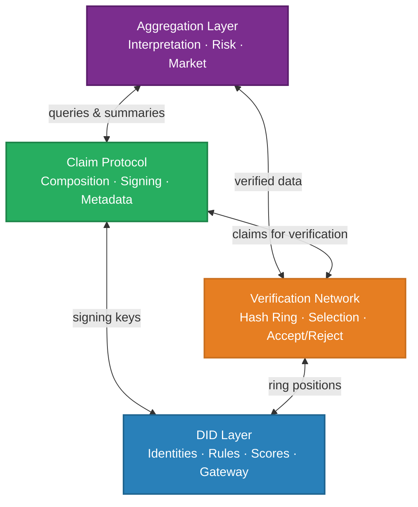
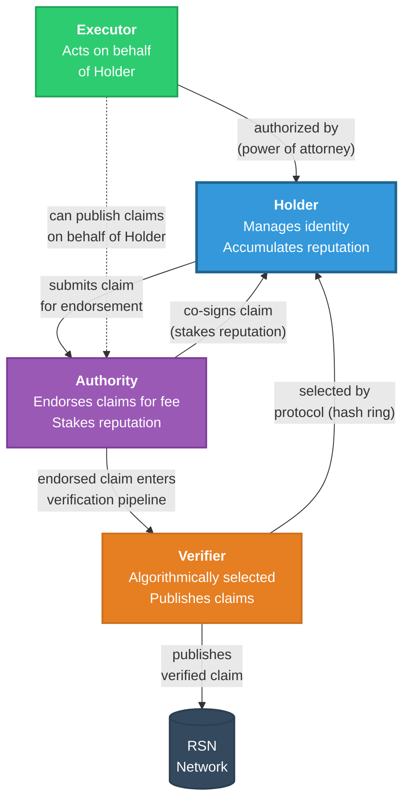
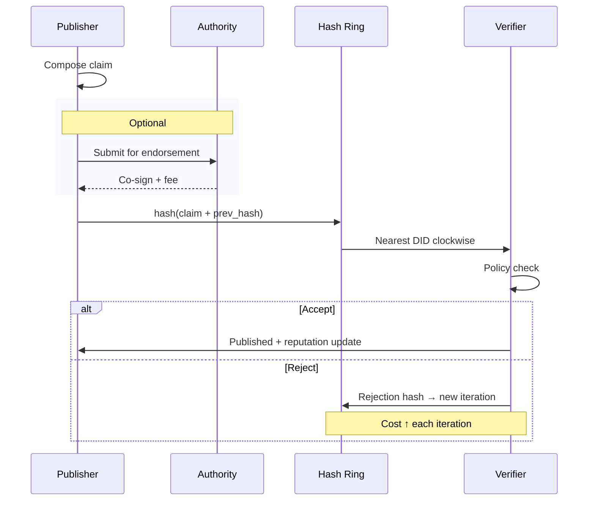
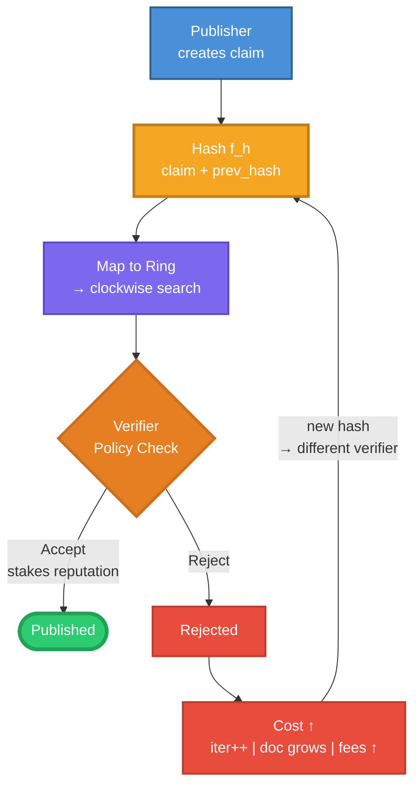
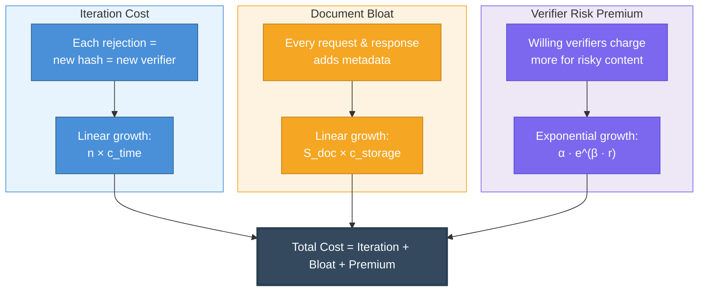
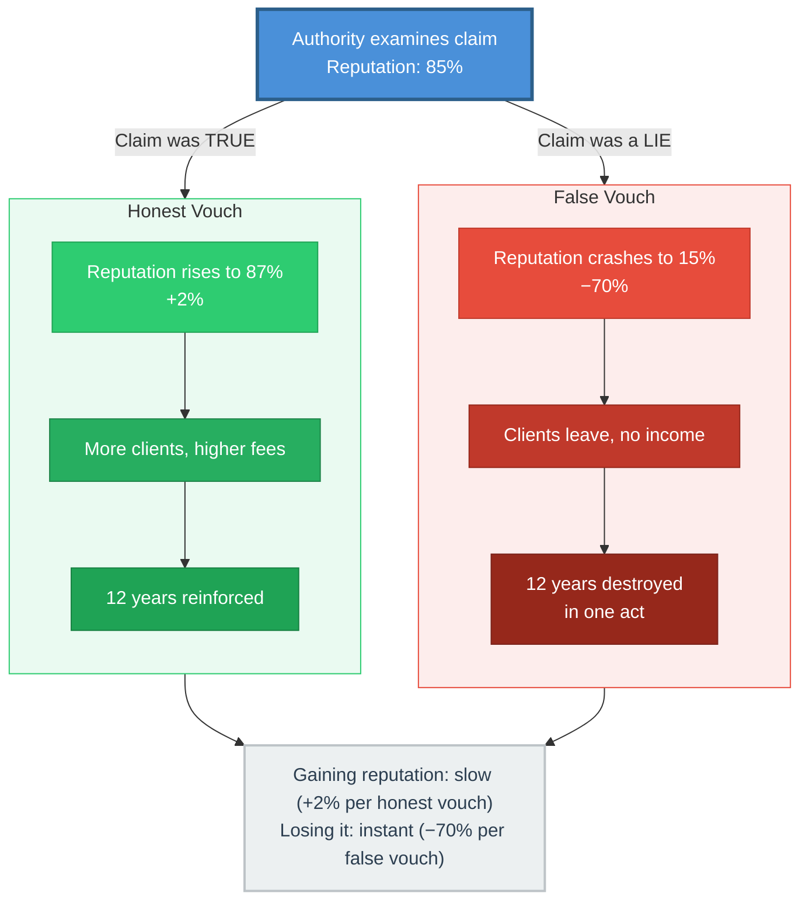
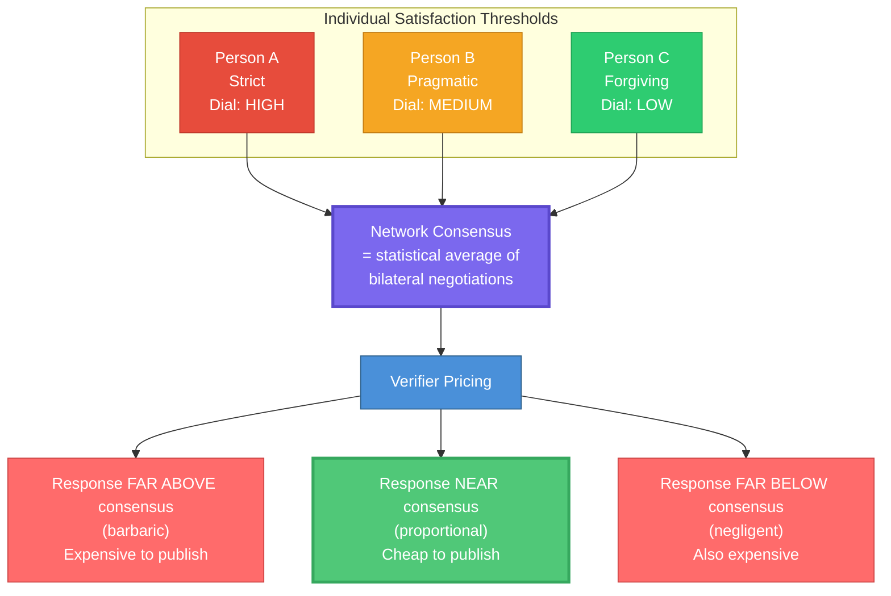
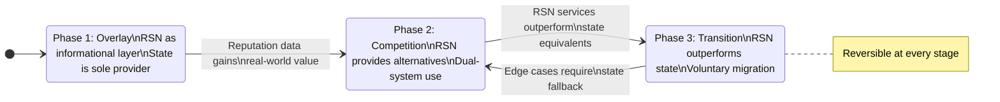

# Decentralized Reputation Network: A Framework for Voluntary Societal Organization

**Pavel Kudrna**
Prague, Czechia

**Draft v1 — March 2026**

---

<!-- \begin{abstract} -->

## Abstract

Centralized institutions of governance — courts, registries, regulatory bodies — suffer from a structural misalignment between the cost of accessing justice and the scale of disputes they are designed to resolve. When the cost of enforcing a right exceeds the value of the right itself, the institutional framework ceases to function as a credible deterrent against misconduct. We propose a Reputation Social Network (RSN): a decentralized, uncensorable and incorruptible communication layer built on Decentralized Identifiers (DIDs) that enables pseudonymous participants to publish, verify, and consume reputation information about real-world behavior. The architecture is designed around two co-equal defensive properties: *uncensorability* — the network cannot be suppressed from outside — and *incorruptibility* — the network cannot be captured from within. The core mechanism rests on three design principles: (1) an asymmetric cost structure where reading reputation data is inexpensive but writing requires verifiable effort, making fraudulent entries economically prohibitive; (2) a nondeterministic verifier selection protocol based on consistent hashing that prices radical or unsubstantiated claims through escalating iteration costs; and (3) a market-driven reputation authority model where private verifiers stake their accumulated reputation on the accuracy of claims they endorse. We demonstrate that this architecture produces emergent consensus without central coordination, creates natural incentives against defamatory or fraudulent behavior, and enables a gradual, reversible migration path from existing state-administered systems toward a merit-based alternative. The proposed system does not require the abolition of existing institutions; rather, it constructs a parallel layer that renders centralized intermediaries progressively unnecessary through voluntary adoption.

<!-- \end{abstract} -->

---

<!-- \section{Introduction} -->

## 1. Introduction

### 1.1 The Problem of Centralized Trust

Modern governance rests on a fundamental assumption: that centralized institutions can mediate trust between strangers at scale. Courts adjudicate disputes. Registries certify ownership. Regulatory bodies enforce standards. These institutions were designed in an era when information was scarce, communication was slow, and delegation of authority to a central body was the only feasible coordination mechanism.

The assumption fails when the cost of institutional mediation exceeds the value of the dispute. Consider a tenant who discovers that their rented apartment lacks a legally required electrical safety certificate — a condition that poses immediate danger to life. The tenant's legal right to withdraw from the contract is unambiguous. Yet the cost of enforcing that right through the court system — attorney fees, statutory waiting periods, fee schedules that reimburse a fraction of actual legal costs — exceeds the monetary value of the deposit and damages owed. The rational response, and the empirically common one, is to absorb the loss and exit [1].

This is not a pathological edge case. It is the default experience for a significant class of disputes in which the harm is real but the monetary stakes fall below the threshold at which institutional enforcement becomes economically rational. The geometry of this failure is straightforward: a party who causes harm faces no credible deterrent when the cost of proving the harm exceeds the harm itself. The institutional framework, designed to protect, becomes a shield for misconduct through its own operational costs.

The problem extends beyond dispute resolution. Building permits are delayed by officials whose aesthetic preferences override community consent [2]. Inheritance proceedings extract fees proportional to estate value rather than case complexity, forcing bereaved families to pay for bureaucratic confirmation of facts already known to all parties. Educational alternatives to failing institutions must be evaluated and approved by the very institutions they seek to replace. In each case, the pattern is identical: a centralized intermediary extracts rents from a process it has made artificially complex, while the individuals closest to the problem — neighbors, family members, communities — have already identified workable solutions that the system refuses to recognize.

### 1.2 Why Existing Solutions Fall Short

Several approaches have been proposed to address the limitations of centralized trust.

**Decentralized Identity (DID) frameworks** [3, 4] provide cryptographic mechanisms for self-sovereign identity management. The W3C DID Core specification [3] defines a standard for decentralized identifiers that can be created, resolved, and managed without a central registry. However, existing DID implementations focus primarily on identity verification and credential issuance — the ability to prove *who you are* — without addressing the broader question of *how you behave*. A DID that certifies your educational credentials says nothing about whether you honor contracts.

**Soulbound Tokens (SBTs)** [5] extend the identity model by proposing non-transferable tokens that encode social relationships and commitments. While SBTs capture the insight that reputation is non-transferable, they rely on blockchain infrastructure that introduces scalability constraints and energy costs disproportionate to the social coordination problems they aim to solve. Furthermore, the SBT model does not address the economic incentives governing information entry — the question of who pays, and how much, to record a claim about another party's behavior.

**Decentralized Autonomous Organizations (DAOs)** [6] implement governance through smart contracts and token-weighted voting. DAOs have demonstrated that collective decision-making without central authority is technically feasible. However, token-weighted governance replicates plutocratic dynamics: influence is proportional to capital, not to demonstrated competence or behavioral track record. Quadratic voting mechanisms [7] partially mitigate this but introduce complexity that limits practical adoption.

**Traditional reputation systems** — credit scores, Yelp reviews, academic citations — demonstrate that reputation information has economic value. However, these systems are centrally administered, censorable, and opaque. A credit bureau can unilaterally destroy a person's financial access. A platform can delete reviews that conflict with its commercial interests. No existing system combines the properties required for a societal-scale trust infrastructure: decentralization, censorship resistance, pseudonymity, verifiable cost of entry, and emergent consensus.

### 1.3 Our Contribution

We make the following contributions:

1. We define the **Reputation Social Network (RSN)**, a decentralized communication protocol that extends the DID framework to support bilateral reputation exchange between pseudonymous participants.

2. We propose a **nondeterministic verifier selection protocol** based on consistent hashing that algorithmically assigns verification responsibility, ensuring that no single entity controls the publication of reputation information.

3. We introduce the **Expensive Radicalism Principle**, a mechanism design that prices the publication of claims according to their distance from network consensus through three compounding cost channels: iteration costs, document bloat, and verifier risk premiums.

4. We describe a **Reputable Authority model** in which private verification services stake their accumulated reputation on the accuracy of claims they endorse, creating asymmetric incentives where the cost of endorsing falsehood catastrophically exceeds the revenue from endorsing truth. This asymmetry — slow accumulation, rapid destruction — is the cornerstone of the system's *incorruptibility*: bribing an Authority is strictly dominated by honest practice, because a single successful bribe destroys more reputational capital than any feasible payoff can restore.

5. We propose a **gradual migration path** from existing state-administered systems to the RSN through parallel fiscal infrastructure — simplified taxation, electronic spending registration, and citizen-directed tax allocation — that creates competitive pressure without requiring institutional abolition.

### 1.4 Paper Outline

Section 2 establishes the design principles that constrain the system architecture. Section 3 provides a high-level overview of the RSN and its components. Section 4 describes the decentralized identity model and claim lifecycle. Section 5 details the information verification and propagation protocol. Section 6 analyzes the reputation and risk assessment mechanisms. Section 7 addresses consensus formation and dispute resolution. Section 8 presents the economic model and incentive structure. Section 9 describes the proposed migration path from existing systems. Section 10 provides a security analysis of known attack vectors. Section 11 discusses privacy considerations. Section 12 surveys related work. Section 13 acknowledges limitations and open questions. Section 14 concludes.

---

<!-- \section{Design Principles} -->

## 2. Design Principles

The RSN architecture is constrained by five design principles derived from an analysis of why previous attempts at societal coordination have failed. These principles are non-negotiable — any implementation that violates them is outside the scope of this proposal.

### 2.1 Continuity and Evolution

The system must coexist with existing institutions during a transition period of indefinite length. It does not require the abolition, disruption, or replacement of any existing structure. Instead, it constructs a parallel infrastructure that becomes progressively more attractive through competitive advantage. The metaphor is a bridge built alongside an existing ferry service: the ferry is not banned, but adoption shifts naturally toward the more efficient option.

This principle has a critical corollary: the transition must be **reversible at every stage**. If the new system fails to deliver superior outcomes, participants can return to the existing institutional framework without loss. Irreversible transitions — revolutions — carry catastrophic downside risk and are excluded by design.

### 2.2 Voluntariness and Responsibility

Participation in the RSN is voluntary. No individual is compelled to create a DID, publish claims, or consume reputation data. However, voluntariness is coupled with responsibility: a participant who assumes control over an institutional function (e.g., dispute resolution, contract enforcement) simultaneously assumes the obligations that accompany it. There are no "positive rights" — no entitlement to services that the participant has not helped build or fund.

This coupling is analogous to the transition from employment to self-employment. The self-employed individual gains autonomy but forfeits the guarantee of a fixed salary. The RSN offers an analogous trade: more control over institutional interactions, paired with more exposure to consequences.

### 2.3 Diversity and Cultural Neutrality

The system must function across cultural, legal, and political boundaries without encoding the normative assumptions of any particular jurisdiction. Consensus emerges from bilateral interactions between participants, not from preset rules imposed by system designers. What constitutes "reasonable" punishment for breach of contract may differ between communities, and the system must accommodate this variation without fragmenting.

### 2.4 Resilience: Uncensorability and Incorruptibility

The system must resist suppression by state-level adversaries. The cost of censoring the network must exceed the cost of tolerating it. This principle establishes a minimum bar for technical architecture: no single point of failure, no centralized infrastructure that can be seized or shut down, and communication channels that route around censorship.

The escalation ladder for a state-level adversary is: block specific websites (defeated by mirrors and VPNs), ban encryption (defeated by steganography), shut down the internet (self-destructive economically), or impose full totalitarianism (politically unsustainable in most regimes). The system must be designed such that only the final option — at ruinous political and economic cost — can suppress it.

Resilience, however, has two faces. *Uncensorability* protects the network against external suppression — states, ISPs, infrastructure seizure. *Incorruptibility* protects it against internal capture — bribes, coerced authorities, colluding verifiers. A system that is merely uncensorable can still be turned into a lie machine by whoever buys its loudest voices; a system that is merely incorruptible can still be silenced by a sufficiently determined state. Both properties are load-bearing, and the remainder of this paper treats them as co-equal design constraints.

### 2.5 Incorruptibility

If Section 2.4 asks whether the network can be *silenced*, this section asks whether it can be *turned*. An uncensorable system that is nevertheless captured from within — whose authorities can be bribed, whose verifiers can be coerced, whose public rules can be quietly broken — is not a justice infrastructure; it is a laundering service for lies. We therefore treat incorruptibility as a design property co-equal with uncensorability.

We treat incorruptibility not as the output of any single enforcement gadget but as a system-level property that emerges from the interaction of several design principles at once. Chief among them are the mutuality of freedom and responsibility (§2.2) — every participant is free to act according to their own policy, but inseparably obliged to publish that policy and be judged by it — and the unrestricted right of any participant to publish commentary on any other, with no licensed class of commentators and no platform gatekeeper. Further properties of the protocol, analyzed in detail in the sections that follow, reinforce the same direction. The three mechanisms listed below are the most immediately legible contributors, but they are not exhaustive; the list is open.

We say the RSN is *incorruptible* in the following economic sense: no strategy available to an internal actor — a Holder, an Authority, a Verifier, or any coalition thereof — yields positive expected value through lying, bribe-taking, or capture of a role. Corruption is not forbidden by the protocol; it is priced above any achievable payoff. What matters is that no single pillar carries this load alone; incorruptibility is what remains when all of the design's mutually reinforcing pressures fail to be circumvented simultaneously.

Three of the most legible enforcement mechanisms, each analyzed in detail later:

1. **Unpredictable target.** Verifier selection is nondeterministic (§5.2). An adversary cannot buy the compliance of a specific Verifier in advance, because neither party knows in advance whose compliance will be needed.

2. **Asymmetric reputational leverage.** Reputation accumulates slowly and collapses catastrophically (§6.1, §6.2). For any bribe *b* and any role with accumulated reputation *R*, detection probability *p*, and reputation loss factor λ ≈ 0.7, the condition *b* > *pλR* must hold for corruption to be rational — and *R* grows without bound while *b* cannot.

3. **Public promise.** Declared rules (§4.1) convert private behavior into publicly auditable commitment. Every deviation is a *publishable claim*; the hypocrisy penalty (§8.1) makes undetected breach the only viable form of breach, and pseudonymity does not provide it.

4. **Attack-cost asymmetry between hierarchies and meshes.** The cost of capturing a hierarchical institution is roughly the cost of capturing its apex: one well-placed bribe, one compromised minister, one captured regulator, and the entire downstream chain of command follows. The cost scales approximately with the depth of the pyramid — that is, slowly. In a flat mesh of independent peers no such apex exists; to bend the system an adversary must corrupt a supermajority of mutually uncoordinated participants, each with their own reputation at stake and their own published policy to contradict. The cost of a successful attack grows with the size of the mesh — in practice, fast enough that it passes any realistic attacker's budget long before it reaches the majority threshold. In hierarchies, corruption is cheap; in the mesh, it is cheaper *not* to corrupt. This is not a moral claim about the participants — it is an arithmetic claim about the topology.

Uncensorability and incorruptibility are the two walls of the same room. The first keeps the state out; the second keeps the cartel out. The remainder of this paper treats both as non-negotiable.

### 2.6 Consensus and Enforcement

The system must contain a built-in mechanism for negotiating rules and a repressive component for enforcing them. This is not a utopian proposal in which all participants act in good faith. The design explicitly incorporates human tendencies toward pettiness, spite, envy, and the desire for retributive satisfaction. These traits are treated not as defects to be suppressed but as load-bearing features of the social architecture — "bricks" from which a stable wall can be constructed, provided the "mortar" (system design) is well-formulated.

The enforcement mechanism operates through economic incentives rather than coercive authority. Misconduct is not prohibited; it is priced. The cost of antisocial behavior escalates nonlinearly, creating a natural deterrent without requiring a monopoly on legitimate violence.

---

<!-- \section{System Overview} -->

## 3. System Overview

### 3.1 Reputation Social Network

The Reputation Social Network (RSN) is a decentralized, peer-to-peer communication layer in which participants exchange verifiable information about real-world behavior. It is conceptually analogous to a review platform — "Yelp for human relationships" — but with several critical distinctions:

- **Decentralized and uncensorable.** No central server, no single operator, no kill switch.
- **Incorruptible by design.** No fixed Verifier to bribe, no Authority that profits from lying, no declared rule that can be silently broken. Corruption is not prohibited — it is priced above any achievable payoff.
- **Pseudonymous.** Participants interact through Decentralized Identifiers (DIDs) that are not inherently linked to legal identities.
- **Asymmetric cost structure.** Reading reputation data is inexpensive. Writing — publishing a new claim about another party — requires verifiable expenditure of time, energy, and money.
- **Verifiable.** Claims are cryptographically signed, algorithmically verified, and permanently recorded.

The fundamental insight is that a reputation system acquires value in proportion to the cost of entering false information. When publishing a claim is free (as in social media), the system fills with noise. When publishing a claim is expensive and verifiable, the surviving information is disproportionately accurate — not because participants are honest, but because dishonesty is priced out of the market.

### 3.2 Architectural Components

The RSN consists of four primary components:

1. **DID Layer.** Each participant holds one or more DIDs conforming to the W3C DID Core specification [3], extended with RSN-specific properties including declared behavioral rules, reputation metadata, and network routing information.

2. **Claim Protocol.** A structured format for publishing assertions about real-world events — both negative (breach of contract, evidence of misconduct) and positive (fulfilled obligations, corrective actions taken). Each claim is a signed document with defined fields, verification requirements, and cost metadata.

3. **Verification Network.** A decentralized protocol for assigning verifiers to incoming claims using consistent hashing and nondeterministic selection. Verifiers stake their own reputation on the accuracy of claims they endorse.

4. **Reputation Aggregation Layer.** A set of services — potentially offered by competing market participants — that consume raw claim data and produce human-readable reputation summaries, risk assessments, and decision-support information.

*Figure 1: RSN Architecture — four-layer component hierarchy and inter-layer communication.*

### 3.3 Participant Roles

A DID in the RSN may assume one or more of four roles:

- **Holder.** The DID owner who manages their identity, declares behavioral rules, and accumulates reputation.
- **Executor.** A party authorized to act on behalf of a Holder — analogous to a power of attorney.
- **Authority.** A DID that provides verification, arbitration, or endorsement services for a fee, staking its own reputation on the quality of its work.
- **Verifier.** A DID algorithmically selected by the verification protocol to review and publish a specific claim.

These roles are not mutually exclusive. A single DID may simultaneously hold its own reputation, execute actions on behalf of another Holder, provide Authority services, and serve as an algorithmically selected Verifier for incoming claims.

---

<!-- \section{Decentralized Identity Model} -->

## 4. Decentralized Identity Model

### 4.1 DID with Special Properties

The RSN extends the W3C DID Core specification [3] with properties specific to reputation exchange. Each DID document includes:

- **Declared Rules.** A machine-readable specification of the behavioral rules the Holder commits to follow. Examples include delivery guarantees ("30-day delivery"), dispute resolution commitments ("disputes resolved within one week"), and data handling policies ("no resale of customer data"). Declared rules are public and verifiable — any discrepancy between declared rules and observed behavior constitutes a publishable claim.

- **Reputation Metadata.** An aggregated score reflecting the Holder's behavioral track record, computed from the totality of verified claims associated with the DID. The score is not centrally computed; rather, each consuming party may apply their own aggregation function to the raw claim data.

- **Network Routing.** The DID's actual network address (onion gateway) is separate from its identifier and is mutable. Holders can redirect routing by signing a new version of the DID document. This separation ensures that the DID's position on the consistent hash ring (used for verifier selection) is stable even as the Holder's network location changes.

### 4.2 Four Roles of a DID

The four roles described in Section 3.3 interact through a defined lifecycle:

*Figure 2: Four DID roles and their interactions. Roles are not mutually exclusive.*

- A **Holder** publishes claims about events they have witnessed or experienced. The claim enters the verification pipeline.
- An **Executor** may publish claims on behalf of a Holder, subject to cryptographic authorization.
- An **Authority** reviews claims submitted for endorsement and, if satisfied with their credibility, stakes its reputation by co-signing the claim. The Authority charges a fee proportional to the perceived risk of the claim.
- A **Verifier** is algorithmically selected by the consistent hashing protocol (Section 5.2) to review and publish a claim to the network. The Verifier may accept or reject the claim based on their own policies.

### 4.3 Claim Lifecycle

A Claim proceeds through the following stages:

1. **Composition.** The Holder constructs a structured claim document describing a real-world event — e.g., "Party X failed to deliver goods within the contractually agreed timeframe."

2. **Optional Authority Endorsement.** The Holder may submit the claim to a Reputable Authority for endorsement. If the Authority finds the claim credible, it co-signs the document, lending its accumulated reputation to the claim's weight. The Authority charges a fee reflecting the risk assessment.

3. **Verifier Selection.** The claim document is hashed together with the previous iteration's hash result (or a null value on the first iteration) to produce a position on the consistent hash ring. The nearest DID clockwise from this position is the selected Verifier candidate.

4. **Verification Decision.** The selected Verifier examines the claim against their own policies. Two outcomes are possible:
   - **Acceptance.** The Verifier publishes the claim to the network, staking their own reputation on the decision.
   - **Rejection.** The claim is not published. The rejection itself becomes part of the claim's metadata, and the process returns to step 3 with the rejection hash as input, producing a different Verifier candidate.

5. **Publication.** Once accepted, the claim is immutably recorded in the network and becomes part of the subject's reputation data.

6. **Reputation Update.** All parties involved — the Holder, the subject of the claim, the Authority (if any), and the Verifier — experience reputation adjustments reflecting the outcome.

### 4.4 Relationship to W3C DID Core

The RSN's identity model is a proper superset of the W3C DID Core specification [3]. All RSN DIDs are valid W3C DIDs and can interoperate with existing DID infrastructure. The RSN-specific extensions — declared rules, reputation metadata, and the claim protocol — are encoded as DID document properties and service endpoints defined in a dedicated DID method specification.

The RSN does not require participants to use a specific DID method. Any method that supports the required document properties (mutable routing, signed updates, resolvable identifiers) is compatible. This ensures that the RSN can leverage existing DID infrastructure (e.g., ION [8], Ceramic [4]) without creating vendor lock-in.

*Figure 7: Claim lifecycle — from composition through optional endorsement to verification and publication.*

---

<!-- \section{Information Verification and Propagation} -->

## 5. Information Verification and Propagation

### 5.1 Cost of Information Entry

The RSN's core economic principle is the asymmetry between reading and writing. Reading reputation data — querying another party's track record before entering a transaction — is inexpensive, approaching zero marginal cost. Writing — publishing a new claim about another party's behavior — requires verifiable expenditure across three dimensions:

- **Time.** The verification process requires waiting for algorithmically selected Verifiers to respond, with each iteration consuming calendar time.
- **Energy.** The claim document must be constructed, cryptographically signed, and submitted according to protocol requirements.
- **Money.** Verifiers charge fees for their services, and these fees escalate with the perceived risk of the claim (see Section 5.4).

These three cost dimensions are fundamentally interconvertible — time can be exchanged for money, energy for time — but reputation cannot be purchased instantly. It must be accumulated through sustained, consistent behavior over time. This irreducibility is what makes the RSN resistant to Sybil attacks and reputation manipulation.

### 5.2 Algorithmic Verifier Selection

The verification protocol employs consistent hashing [9] to assign Verifier candidates to incoming claims. The procedure is as follows:

**Step 1: Hash Generation.** The claim document is concatenated with the hash result from the previous iteration (or a null value ∅ on the first iteration) and passed through a cryptographic hash function *f_h*:

[EQ: ring_position = f_h(claim_document || previous_hash)]

**Step 2: Ring Mapping.** The resulting hash is mapped to a position on a consistent hash ring representing the DID Identifier Space. All registered DIDs occupy positions on this ring determined by their own document hashes.

**Step 3: Clockwise Search.** Starting from the mapped position, the protocol searches clockwise along the ring until it encounters the nearest DID. This DID becomes the Verifier candidate for the current iteration.

**Step 4: Policy Check.** The selected Verifier evaluates the claim against its declared policies. If the Verifier's policies are compatible with the claim's content, the Verifier may accept and publish the claim. If not, the Verifier rejects, and the process returns to Step 1 with the rejection hash as input.

*Figure 3: Nondeterministic verifier selection protocol — the core mechanism that prices radical claims.*

The critical property of this protocol is that each rejection produces a different hash, which maps to a different ring position, which selects a different Verifier candidate. The publisher cannot predict or influence which Verifier will be selected, and each iteration is computationally independent of previous iterations. This unpredictability is a structural *incorruptibility* guarantee: there is no fixed target for bribery or coercion. An adversary cannot buy a specific Verifier's compliance in advance, because they cannot know whose compliance they will need.

### 5.3 Non-deterministic Onion Routing

The DID's position on the consistent hash ring is determined by its document hash, which is stable. The DID's actual network address — its onion gateway — is separate and mutable. This separation serves two purposes:

1. **Privacy.** The network location of a DID can be changed without affecting its ring position, preventing network-level tracking of identity.
2. **Routing flexibility.** A Holder can redirect their onion gateway by signing a new version of the DID document, enabling migration between network nodes without identity disruption.

The term "onion routing" refers to the layered encryption of communication between DIDs, where each intermediary node decrypts only its own layer, preventing any single node from knowing both the sender and recipient of a message.

### 5.4 Expensive Radicalism Principle

The iteration mechanism described in Section 5.2 produces a natural cost escalation for claims that deviate from network consensus. Three cost channels compound simultaneously:

**Channel 1: Iteration Cost.** Each rejection forces a new iteration of the verification protocol. Credible, well-supported claims are typically accepted by the first or second Verifier candidate. Claims that most Verifiers find objectionable require many iterations, each consuming time and computational resources.

**Channel 2: Document Bloat.** Each iteration — including rejections — adds metadata to the claim document. Requests sent, responses received, and Verifier identities all become part of the document's permanent record. A claim that required 20 iterations to find a willing Verifier produces a document approximately 20 times larger than one accepted on the first attempt, incurring proportionally higher storage and transmission costs.

**Channel 3: Verifier Risk Premium.** When a Verifier does eventually accept a controversial or radical claim, it recognizes the reputational risk of endorsement. A Verifier who publishes a claim that the network broadly considers unsubstantiated or defamatory stakes its own reputation. Accordingly, willing Verifiers charge a premium proportional to the perceived risk: base fee for credible claims, 3× for controversial claims, 10× or more for radical claims. The risk premium is not merely economic pricing — it is the local manifestation of *incorruptibility*: the Verifier is pricing the probability that their endorsement will later be exposed as false, and with it their accumulated reputation destroyed.

*Figure 4: Three compounding cost channels — not censorship, but pricing.*

The compounding effect is significant. A claim at the far end of the radicalism spectrum faces not merely high costs but the product of high iteration count, large document size, and extreme verifier premiums. The total cost of publishing a fraudulent claim can exceed any plausible benefit, rendering systematic fraud economically irrational.

Critically, this is not censorship. No claim is prohibited. The system does not evaluate truth; it prices risk. A radical claim can be published — at a price that reflects the network's collective assessment of its plausibility.

*Table 1: Cost comparison across claim types.*

| Claim Type | Iterations | Document Size | Verifier Fee | Total Cost |
|---|---|---|---|---|
| **Credible** | 1–2 | Small | Base | Low |
| **Controversial** | 5–10 | Medium | 3× base | Moderate |
| **Radical** | 15–30 | Large | 10× base | Very high |
| **Fraudulent** | ∞ | — | — | Unpublishable |

---

<!-- \section{Reputation and Risk Assessment} -->

## 6. Reputation and Risk Assessment

### 6.1 Reputation Accumulation Model

Reputation in the RSN is an emergent property of a DID's behavioral history, computed from the totality of verified claims associated with that identifier. The model exhibits three defining characteristics:

**Slow accumulation.** Reputation grows incrementally through consistent, verified behavior over time. Each honest transaction, fulfilled commitment, or successfully verified claim adds a small positive increment to the DID's aggregate score. There are no shortcuts — reputation cannot be purchased, transferred, or fabricated.

**Rapid destruction.** A single verified instance of fraud, contract breach, or hypocrisy (discrepancy between declared rules and observed behavior) can reduce a DID's reputation score catastrophically. The asymmetry between accumulation and destruction — slow to build, fast to lose — creates a powerful incentive for honest behavior. This asymmetry is the mathematical expression of *incorruptibility*: any bribe large enough to compensate for the expected loss of reputation exceeds, in practice, the value obtainable from the corrupt act itself.

**Individual evaluation.** The RSN does not impose a single, universal reputation score. Each consuming party may apply their own aggregation function to the raw claim data, weighting different categories of behavior according to their own risk tolerance. A landlord may weight housing-related claims heavily. An employer may focus on professional conduct. A lender may aggregate financial behavior.

### 6.2 Reputable Authorities

A Reputable Authority is a DID that provides professional verification, endorsement, or arbitration services within the RSN. The Authority model is analogous to a notary whose business depends entirely on their track record:

- The Authority reviews claims submitted by Holders and, if satisfied with their credibility, co-signs them — staking its own reputation on the accuracy of the endorsement.
- The Authority charges fees proportional to the assessed risk of the claim. Low-risk, well-documented claims attract base fees. High-risk or controversial claims attract premium fees.
- If a claim endorsed by an Authority is subsequently demonstrated to be false, the Authority's reputation suffers disproportionately. The asymmetry is by design: gaining reputation as an Authority is slow and incremental (+2% per honest endorsement), while losing it is catastrophic (−70% per false endorsement).

This asymmetry ensures that the Authority's optimal strategy is always to reject suspicious claims — because one false endorsement costs more than a thousand legitimate fees. *This is what we mean by incorruptibility: not that Authorities are morally virtuous, but that corruption is priced out of their utility function.* The Authority market is self-regulating: Authorities with high reputation attract more clients and can charge higher fees; Authorities with declining reputation lose clients and eventually exit the market.

### 6.3 Individual Risk Evaluation

The RSN democratizes a capability that currently belongs almost exclusively to financial institutions: systematic risk assessment. Banks evaluate counterparty risk as a core business function — credit scores, KYC procedures, automated risk models. This capability is withheld from ordinary individuals, who must rely on intuition, word of mouth, or expensive professional advice.

In the RSN, reputation data is public and machine-readable. A market of interpretation services — analogous to credit rating agencies but operating in a competitive, decentralized environment — can emerge to translate raw reputation data into actionable summaries. The cost of a risk assessment query approaches the marginal cost of data processing, making systematic counterparty evaluation accessible to any participant.

### 6.4 Market for Reputation Services

The RSN infrastructure enables a market of services built on reputation data:

- **Insurance providers** that use verified behavioral history to price risk more accurately than traditional actuarial models.
- **Lending services** that evaluate creditworthiness based on demonstrated reliability rather than collateral alone.
- **Employment verification** based on actual track records rather than self-reported credentials.
- **Community coordination** platforms that allocate shared resources based on reputation-weighted trust.

Each service provider is itself a DID participant, subject to the same reputation mechanisms as any other actor. Service quality is verifiable, and poor-quality services are priced out of the market through the same mechanisms that govern individual reputation.

*Figure 5: Reputable Authority — asymmetric incentives. Slow gain (+2%) vs. catastrophic loss (−70%).*

---

<!-- \section{Consensus and Dispute Resolution} -->

## 7. Consensus and Dispute Resolution

### 7.1 Decentralized Justice Model

The RSN reframes justice as a bilateral negotiation problem rather than a centralized adjudication problem. When a dispute arises between two parties, the resolution process does not require a court, a judge, or a statutory procedure. Instead, it operates through the following mechanism:

1. The aggrieved party publishes a claim describing the dispute and the harm incurred.
2. The claim enters the verification pipeline (Section 5), where algorithmically selected Verifiers assess its credibility.
3. The subject of the claim may respond with a counter-claim, correction, or offer of restitution.
4. Reputation adjustments — visible to all future counterparties — create economic incentives for resolution.

The key insight is that the threat of permanent, verifiable reputation damage is a more effective deterrent than the threat of legal proceedings that the harmed party cannot afford. In the current system, a landlord who rents an unsafe apartment faces no credible consequence because enforcement costs exceed the harm. In the RSN, a verified claim about unsafe conditions attached to the landlord's DID permanently reduces their ability to attract tenants, charge market-rate rents, or obtain verification services at reasonable prices.

### 7.2 Satisfaction vs. Truth-seeking

The RSN's dispute resolution model optimizes for **satisfaction** — the subjective sense that a wrong has been adequately addressed — rather than for objective truth determination. This is a deliberate design choice.

Each participant maintains a personal "satisfaction threshold" — the level of response they consider adequate for a given category of harm. Some participants demand strict accountability (full compensation plus public acknowledgment). Others accept pragmatic resolution (compensation without publicity). Still others are forgiving (an apology suffices).

No external authority dictates where these thresholds should be set. The network's aggregate consensus emerges as the statistical average of thousands of bilateral satisfaction negotiations. A response that falls far above the consensus (barbaric punishment) is expensive to publish. A response that falls far below (negligent indifference) is also expensive. Being near the consensus is cheap. The consensus is not a rule — it is a price signal.

### 7.3 Punishment Calibration Mechanism

Each DID Holder may publicly declare how they will respond to specific categories of misconduct. These declarations are published in the DID document and are visible to all parties before any interaction takes place. The community evaluates these declarations through social feedback:

- **Disproportionately harsh declarations** attract negative reputation signals from the community, increasing the Holder's cost of verification and reducing their attractiveness as a counterparty.
- **Disproportionately lenient declarations** similarly attract scrutiny, as they may signal tolerance for misconduct.
- **Proportional declarations** — those near the network consensus — are accepted without friction.

This mechanism produces a self-calibrating punishment system in which extreme positions — in either direction — are economically disadvantaged without being prohibited.

### 7.4 Appeal and Correction

The RSN explicitly supports repentance and correction. A verified negative claim can be followed by a positive correction claim documenting that the offending party has taken remedial action — voluntarily compensated the victim, accepted sanctions proposed by a Reputable Authority, or otherwise addressed the harm.

Correction claims do not erase the original negative claim. Instead, they provide context that allows future counterparties to make informed judgments. A DID with a negative claim followed by a timely correction may be viewed more favorably than a DID with no negative claims at all — the former demonstrates accountability, while the latter provides no evidence of behavior under adversity.

*Figure 8: Emergent consensus — individual satisfaction thresholds average into a price signal.*

---

<!-- \section{Economic Model} -->

## 8. Economic Model

### 8.1 Incentive Structure

The RSN's incentive architecture is designed to align individual self-interest with collective welfare without requiring altruism. The key incentive mechanisms are:

- **Reputation as capital.** A DID's reputation is its most valuable asset. High reputation reduces the cost of every interaction — lower verification fees, better terms from Authorities, more attractive to counterparties. This creates a direct economic incentive for honest behavior.
- **Hypocrisy penalty.** Declaring behavioral rules without following them is the most expensive failure mode. The gap between declared rules and observed behavior is verifiable, and once exposed, destroys reputation faster than any single act of misconduct — because it demonstrates intentional deception. Declared rules function as *public promises against future self*: they convert private behavior into a publicly auditable commitment, and any deviation is a *publishable claim*. The system does not need to police honesty — honesty is a Schelling point induced by the cost of its opposite.
- **Verifier incentives.** Verifiers are compensated for their work and have a direct economic interest in maintaining accuracy. A Verifier who publishes false claims loses reputation and future income.
- **Authority incentives.** Authorities charge fees proportional to risk and have catastrophic downside exposure from false endorsements. The optimal Authority strategy is conservative truth-telling.

### 8.2 Cost Dynamics

The RSN operates on a principle that can be summarized as: **writing is expensive, reading is free.** This asymmetry serves as the fundamental spam filter, quality control mechanism, and deterrent against abuse.

The cost of writing consists of three components that compound as described in Section 5.4. The cost of reading consists solely of the marginal cost of data retrieval and optional interpretation services.

This asymmetry has a second-order effect: it creates a natural throttle on the volume of information in the network. If entries are scarce, each one carries significant weight — this is the "freedom" configuration. If entries are abundant and trivial, the network approaches surveillance — the "totality" configuration. The aggregate behavior of participants collectively determines where on this spectrum the system operates.

### 8.3 Parallel Fiscal System

The RSN infrastructure enables the construction of a fiscal system that operates in parallel with — and in competition with — existing state-administered taxation. The proposed system consists of three components:

**Simple Tax.** A single proportional rate applied to every transaction, with no exceptions, exemptions, or loopholes. The rate initially starts marginally below the effective rate of the existing system — sufficient to make switching economically rational but not revolutionary. The rate decreases annually, expanding the system's competitive advantage. Compare this to existing tax codes spanning thousands of pages that even professionals struggle to navigate.

**Electronic Spending Registration (ESR).** Inspired by the Czech government's Electronic Sales Registration (EET) system — which required citizens to report every transaction to the state in real time — the ESR inverts the surveillance vector. Every public expenditure is paired with a planned-payment record, producing machine-readable data that citizens, analysts, and political parties can audit. A refundable deposit of 1-3 EUR per entry serves as a spam filter, ensuring that only substantive monitoring entries are recorded.

**Citizen-Directed Tax Allocation.** A percentage of paid taxes can be directed by the taxpayer to specific purposes, conditional on the taxpayer's DID meeting reputation requirements (citizenship, residency, behavioral track record). The allocatable percentage grows exponentially from 5% in Year 1 to approximately 40% by Year 10, gradually shifting fiscal authority from centralized allocation to distributed citizen choice.

### 8.4 Transition Economics

The economic logic of the transition rests on a simple principle: critical mass. A growing cohort of taxpayers signals willingness to switch to conditional funding — continuing to pay taxes normally while joining a waiting list. When the cohort reaches approximately 15% of GDP, the state faces a credible threat to revenue and enters negotiation.

The negotiation process is asymmetric in the citizens' favor: the state yields on simple, transparent expenditures first (where ESR compliance is easy) and resists on problematic, corruption-linked payments last (where transparency is most threatening). Each concession builds trust, shifts more participants to the new system, and increases the pressure for further concessions.

---

<!-- \section{Migration Path} -->

## 9. Migration Path

### 9.1 Coexistence with Current Systems

The RSN is designed for indefinite coexistence with existing state institutions. It does not require, assume, or depend on the collapse, reform, or cooperation of any existing system. Participants operate simultaneously in both systems — paying taxes, obeying laws, and using state services as before, while also building reputation in the RSN.

The coexistence model is analogous to enterprise software migration: when an old system is too entangled to replace, the standard practice is to build a new system in parallel and migrate users gradually. The old system is not decommissioned until the new system has demonstrated superior performance over an extended period.

### 9.2 Institutional Onboarding

Existing institutions — businesses, professional associations, educational institutions — can participate in the RSN without restructuring. A business that creates a DID and publishes its behavioral commitments (delivery terms, dispute resolution policies, quality standards) gains access to the RSN's reputation infrastructure. Customers' verified feedback becomes part of the business's permanent record, creating accountability without regulatory overhead.

### 9.3 Phases of Adoption

The migration proceeds through three phases:

**Phase 1: Overlay.** Early adopters create DIDs and begin recording verified interactions in the RSN while continuing to operate entirely within the existing system. The RSN is an informational overlay — it provides additional data for decision-making but does not replace any existing function.

**Phase 2: Competition.** As the RSN's user base grows, reputation data becomes a competitive advantage. Businesses with high RSN reputation attract more customers. Service providers with verified track records command premium prices. The RSN begins to provide functional alternatives to state-administered services (dispute resolution, contract verification, risk assessment).

**Phase 3: Transition.** When RSN-based services demonstrably outperform their state-administered equivalents in cost, speed, and user satisfaction, voluntary migration accelerates. The state's role contracts to those functions for which no market alternative has emerged (potentially defense, crisis management). This phase may never fully complete — the system is designed to work regardless of whether the old system persists.

### 9.4 Pressure Mechanisms

The primary lever for incentivizing state cooperation is fiscal: the just-in-time funding model described in Section 8.4. The state receives tax revenue only when expenditures are transparently paired with ESR records. The growing cohort of conditional taxpayers creates escalating pressure for compliance.

Secondary pressure mechanisms include:

- **Competitive service provision.** RSN-based dispute resolution that is faster and cheaper than courts reduces demand for state judicial services.
- **Transparency arbitrage.** Public ESR data enables journalists, analysts, and political opponents to identify wasteful spending, creating political consequences for fiscal opacity.
- **Reputation signaling.** Businesses and individuals with high RSN reputation may receive preferential treatment from counterparties, creating network effects that accelerate adoption.

*Figure 6: Three-phase migration — reversible at every stage.*

*Figure 9: Citizen tax allocation — growing citizen control from 5% to 40% over 10 years.*

| Year | Citizen-Directed | State-Managed |
|------|-----------------|---------------|
| 1 | 5% | 95% |
| 3 | 10% | 90% |
| 5 | 15% | 85% |
| 7 | 25% | 75% |
| 10 | 40% | 60% |

*Prerequisites: DID with verified citizenship + residency + reputation. Citizen directs tax — not avoids it. State portion shrinks but never reaches zero.*

---

<!-- \section{Security Analysis} -->

## 10. Security Analysis

### 10.1 Threat Model

We consider five categories of adversaries, ordered by increasing capability:

1. **Individual bad actors** seeking to manipulate their own reputation or damage the reputation of others.
2. **Organized groups** (cartels, mafias) attempting to collude on reputation manipulation.
3. **Corporate adversaries** with significant financial resources seeking to undermine competitors through the RSN.
4. **State-level adversaries** with the capability to surveil, disrupt, or coerce network participants.
5. **Protocol-level adversaries** with the technical capability to exploit vulnerabilities in the verification protocol itself.

### 10.2 Sybil Attack Resistance

A Sybil attack [10] involves creating multiple fake identities to amplify influence or fabricate reputation. The RSN mitigates Sybil attacks through cost-based defense:

- Creating a DID is inexpensive, but building reputation requires sustained, verifiable interaction over time. A Sybil attacker must invest real resources (time, energy, money) in each fake identity proportional to the reputation they seek to fabricate.
- The verification protocol's nondeterministic Verifier selection prevents an attacker from directing claims to colluding Verifiers.
- Claims from newly created DIDs with minimal reputation history carry proportionally less weight in aggregation functions.

The cost of a successful Sybil attack scales linearly with the number of fake identities and quadratically with the target reputation level, making large-scale attacks economically prohibitive.

### 10.3 Collusion and Cartel Formation

Groups of participants may attempt to coordinate reputation inflation (mutual positive feedback) or targeted reputation destruction (coordinated negative claims against a competitor). Defenses include:

- **Graph analysis.** Patterns of mutual endorsement among a closed group of DIDs are detectable through social graph analysis. Reputation aggregation functions can discount claims originating from tightly clustered groups.
- **Diverse source weighting.** Claims from independent, geographically and socially diverse sources carry more weight than claims from correlated sources.
- **Expensive iteration.** Coordinated negative campaigns require publishing multiple claims, each subject to the full cost of the verification protocol. The cost of a sustained campaign scales with the number of claims and the degree of radicalism.

### 10.4 State-level Adversary

A state-level adversary may attempt to:

- **Identify participants** by correlating DID activity with network traffic metadata.
- **Coerce Verifiers** into rejecting or accepting specific claims.
- **Disrupt the network** by blocking communication channels or seizing infrastructure.

Mitigations include onion routing for communication privacy, the absence of centralized infrastructure, and the distribution of the Verifier role across the entire participant base (no specialized "Verifier nodes" that can be selectively targeted). The escalation ladder described in Section 2.4 ensures that suppression requires measures disproportionate to any benefit.

These mitigations address *uncensorability*. The complementary question — whether a state-level adversary can *corrupt* rather than suppress the network by coercing or bribing individual Verifiers — is answered by the incorruptibility properties established in Section 2.5: (i) the target of coercion is unpredictable (Section 5.2), (ii) compliance is visible and permanently recorded, and (iii) the reputational cost of detected compliance exceeds any finite bribe. Coercing one Verifier buys nothing, because the next claim will route to a different Verifier chosen by the protocol; coercing all of them is indistinguishable from running the protocol honestly.

### 10.5 Privacy vs. Accountability Tradeoff

The RSN operates in the tension between two legitimate needs: the individual's right to privacy and the community's interest in accountability. The system resolves this tension through **pseudonymity** — a middle ground between full anonymity (no accountability) and full identity disclosure (no privacy).

A DID's reputation is linked to a persistent pseudonym, not to a legal identity. This allows a DID to accumulate meaningful reputation over time (accountability) without revealing the Holder's real-world identity (privacy). The Holder may choose to link their DID to a legal identity — or not — depending on their personal risk assessment.

---

<!-- \section{Privacy Considerations} -->

## 11. Privacy Considerations

### 11.1 Pseudonymity Architecture

The RSN's privacy model is built on pseudonymity rather than anonymity. Each DID is a persistent identifier that accumulates reputation over time but is not inherently linked to any real-world identity. The Holder controls the degree of identity disclosure:

- **Minimal disclosure.** The DID functions as a pure pseudonym. Reputation is accumulated and consumed without revealing the Holder's legal identity, physical location, or demographic characteristics.
- **Selective disclosure.** The Holder may choose to link specific verified credentials (professional certifications, institutional affiliations) to the DID to enhance credibility, without revealing other personal information.
- **Full disclosure.** The Holder may voluntarily associate the DID with their legal identity, sacrificing privacy for maximum credibility.

### 11.2 Information Asymmetry by Design

The RSN introduces a deliberate information asymmetry: a DID Holder has complete access to their own reputation data and full control over their identity disclosure, while observers have access only to the public reputation record associated with the pseudonym.

This asymmetry is the inverse of the current institutional model, where the state maintains comprehensive identity databases and citizens have limited visibility into how their information is used. In the RSN, the information advantage lies with the individual.

### 11.3 Right to Be Forgotten vs. Immutability

The RSN does not support a "right to be forgotten" in the traditional sense. Published, verified claims are permanent and immutable — this is a prerequisite for the credibility of the reputation system. However, the system supports **contextual correction**:

- Correction claims can document that harm has been remedied.
- Reputation aggregation functions can weight recent behavior more heavily than historical behavior, implementing a form of gradual "forgetting."
- A Holder may abandon a compromised DID and create a new one, forfeiting accumulated reputation in exchange for a clean start. This is not a loophole — the cost of abandoning accumulated reputation is itself a deterrent against behavior that might necessitate it.

---

<!-- \section{Related Work} -->

## 12. Related Work

### 12.1 Decentralized Identity

The W3C DID Core specification [3] establishes the foundational standard for decentralized identifiers. The Ceramic Network [4] implements a protocol for mutable, verifiable data streams anchored to DIDs. ION [8] provides a Bitcoin-anchored DID method with high throughput. The RSN builds on these foundations by extending the DID model from identity verification to behavioral reputation exchange.

### 12.2 Reputation Systems

EigenTrust [11] proposed a distributed algorithm for computing global trust values in peer-to-peer networks, demonstrating that reputation can be aggregated without central authority. Soulbound Tokens [5] introduced the concept of non-transferable tokens encoding social relationships, positioning reputation as a fundamental Web3 primitive. The RSN differs from both approaches in its emphasis on economic cost as a quality filter and its mechanism for pricing radicalism.

### 12.3 Decentralized Governance

DAOs [6] have demonstrated the feasibility of collective governance through smart contracts. Quadratic voting [7] addresses the plutocratic bias of token-weighted governance by making the cost of additional votes scale quadratically. The RSN's consensus mechanism differs fundamentally: rather than implementing voting, it derives consensus from the statistical aggregate of bilateral price negotiations, avoiding both majority-rule pathologies and plutocratic capture.

### 12.4 Political Theory

The RSN draws on anarcho-capitalist theory [12, 13] in its proposal for private provision of traditionally state-administered services (dispute resolution, enforcement, certification). However, it departs from classical anarcho-capitalism in two critical respects: (1) it does not assume rational, self-interested actors but explicitly designs for spite, envy, and retributive impulses; and (2) it proposes a gradual, reversible transition rather than revolutionary abolition of the state.

The concept of emergent social contracts — rules that arise from patterns of interaction rather than from deliberate legislation — has antecedents in Hayek's theory of spontaneous order [14] and in phenomenological approaches to social structure. The RSN operationalizes this concept through measurable, verifiable behavioral data.

---

<!-- \section{Discussion and Limitations} -->

## 13. Discussion and Limitations

### 13.1 Known Limitations

**Cold start problem.** The RSN's value proposition depends on network effects: reputation data is useful only if a critical mass of counterparties participate. Early adopters face a chicken-and-egg problem where the system provides limited value until participation reaches a threshold.

**Inequality of access.** The cost of publishing claims, while designed to filter noise, may also filter legitimate grievances from economically disadvantaged participants. If the cost of reporting a landlord's misconduct is non-trivial, the system may replicate the access barriers of the traditional justice system it aims to replace.

**Reputation inequality.** Early adopters accumulate reputation advantages that may create barriers to entry for latecomers, potentially reproducing the incumbency advantages of existing institutional hierarchies.

**Jurisdictional conflicts.** The RSN operates across legal jurisdictions, but the real-world consequences of reputation — contract enforcement, property disputes, employment decisions — remain subject to local law. A reputation-based dispute resolution that contradicts local legal requirements creates ambiguity.

### 13.2 Open Questions

- **Optimal cost functions.** What cost functions for claim publication minimize both spam and legitimate-grievance suppression? This is an empirical question that requires experimentation and calibration.
- **Aggregation standards.** Should the RSN define recommended reputation aggregation functions, or should aggregation be entirely market-driven? Standardization improves interoperability but risks homogenizing risk assessment.
- **Governance of the protocol itself.** How should the RSN's technical parameters (hash functions, cost coefficients, document format standards) be updated over time? A BIP/CIP-style improvement proposal process [4] is a candidate model but requires community governance infrastructure.
- **Interaction with AI.** As AI systems become capable of generating synthetic reputation data, the RSN's cost-based defenses must be calibrated against adversaries with potentially superhuman patience and minimal marginal cost of operation.

### 13.3 What This Paper Does Not Claim

This paper does not claim that the RSN will produce optimal outcomes in all circumstances. It does not claim that market-based reputation mechanisms are superior to all forms of institutional governance. It does not claim that the transition from state-administered systems to decentralized alternatives will be smooth, rapid, or inevitable.

What this paper does claim is that the RSN represents a *feasible* alternative — one that is technically implementable, economically self-sustaining, and socially compatible with human behavioral tendencies as they actually are, rather than as idealists wish them to be.

---

<!-- \section{Conclusion} -->

## 14. Conclusion

We have presented the Reputation Social Network (RSN), a decentralized communication protocol that extends the DID framework to enable pseudonymous, verifiable reputation exchange. The RSN addresses a fundamental limitation of centralized governance: the misalignment between the cost of institutional enforcement and the scale of disputes that most individuals actually face.

The system's core mechanism — asymmetric cost of information entry, nondeterministic verifier selection, and market-driven reputation authority — produces emergent consensus without central coordination. Together these mechanisms realize two complementary properties: *uncensorability* — the network cannot be shut down from outside — and *incorruptibility* — the network cannot be captured from within. The first protects expression; the second protects truth. The Expensive Radicalism Principle ensures that fraudulent or unsubstantiated claims are priced out of the system without being censored, preserving freedom of expression while creating economic consequences for dishonesty.

The proposed migration path — parallel fiscal infrastructure with escalating citizen control — enables a gradual, reversible transition from existing institutional frameworks. The system does not require the abolition of the state; it constructs a competitive alternative that renders centralized intermediaries progressively unnecessary through voluntary adoption.

The design explicitly incorporates human nature as it is — including pettiness, spite, envy, and the desire for retributive satisfaction — rather than requiring a "new man" compatible with ideological premises. The result is not utopia. It is a system in which justice is accessible, reputation is earned, and the cost of misconduct is borne by the party who caused it rather than by the party who suffered it.

---

## References

[1] P. Kudrna, "Political Pamphlet: What Is the Problem?", unpublished manuscript, Prague, 2025.

[2] European Commission, "Reducing the administrative burden on citizens," COM(2012) 746, 2012.

[3] M. Sporny, D. Longley, M. Sabadello, D. Reed, O. Steele, and C. Allen, "Decentralized Identifiers (DIDs) v1.0," W3C Recommendation, July 2022.

[4] Ceramic Network, "Ceramic Protocol Specification," GitHub, 2023. Available: https://github.com/ceramicnetwork

[5] E. G. Weyl, P. Ohlhaver, and V. Buterin, "Decentralized Society: Finding Web3's Soul," SSRN, May 2022.

[6] V. Buterin, "DAOs, DACs, DAs and More: An Incomplete Terminology Guide," Ethereum Blog, May 2014.

[7] V. Buterin, Z. Hitzig, and E. G. Weyl, "A Flexible Design for Funding Public Goods," Management Science, vol. 65, no. 11, pp. 5171–5187, 2019.

[8] D. Buchner, "ION — A Scalable DID Method Based on Bitcoin," Microsoft, 2021.

[9] D. Karger, E. Lehman, T. Leighton, R. Panigrahy, M. Levine, and D. Lewin, "Consistent Hashing and Random Trees: Distributed Caching Protocols for Relieving Hot Spots on the World Wide Web," in Proc. 29th ACM STOC, 1997, pp. 654–663.

[10] J. R. Douceur, "The Sybil Attack," in Proc. 1st International Workshop on Peer-to-Peer Systems (IPTPS), 2002, pp. 251–260.

[11] S. D. Kamvar, M. T. Schlosser, and H. Garcia-Molina, "The EigenTrust Algorithm for Reputation Management in P2P Networks," in Proc. 12th International Conference on World Wide Web, 2003, pp. 640–651.

[12] M. N. Rothbard, "For a New Liberty: The Libertarian Manifesto," Macmillan, 1973.

[13] H.-H. Hoppe, "Democracy: The God That Failed," Transaction Publishers, 2001.

[14] F. A. Hayek, "Law, Legislation and Liberty," University of Chicago Press, 1973.

---

<!-- Appendices -->

## Appendix A: Czech Tax Reform — A Locale-Specific Use Case

The Czech Republic provides a particularly instructive case study for the RSN's parallel fiscal infrastructure. Between 2016 and 2022, the Czech government implemented Electronic Sales Registration (EET, *Elektronická evidence tržeb*) — a system requiring businesses to report every transaction to state servers in real time. The stated purpose was tax compliance; the operational effect was comprehensive state surveillance of private commercial activity.

The ESR proposal described in Section 8.3 inverts this model: rather than the state surveilling citizens' transactions, citizens surveil the state's expenditures. The symmetry is deliberate. If the state considers real-time transaction reporting appropriate for a village vendor selling twelve jars of jam, the same principle should apply — with greater force — to public expenditures funded by those same vendors' taxes.

The Czech context also illustrates the cold-start dynamics of the transition. The Czech Republic's GDP is approximately €290 billion. A 15% GDP threshold for negotiation leverage requires approximately €43.5 billion in conditional tax revenue — a cohort of several million taxpayers. While this is a large absolute number, it represents a smaller organizational challenge than many historical social movements that lacked the coordination infrastructure the RSN provides.

## Appendix B: Glossary

| Term | Definition |
|---|---|
| **Claim** | A structured, signed document asserting a fact about a real-world event involving a DID participant. |
| **Consistent Hash Ring** | A circular address space used for nondeterministic verifier selection. |
| **DID** | Decentralized Identifier, per W3C specification [3]. |
| **ESR** | Electronic Spending Registration — citizen-operated monitoring of public expenditures. |
| **Expensive Radicalism** | The principle that claims distant from network consensus incur escalating costs. |
| **Holder** | The owner and controller of a DID. |
| **Onion Gateway** | The mutable network address associated with a DID, separate from its ring position. |
| **Reputable Authority** | A DID providing professional verification services, staking its reputation on endorsements. |
| **RSN** | Reputation Social Network — the complete system described in this paper. |
| **Verifier** | A DID algorithmically selected to review and publish a specific claim. |
