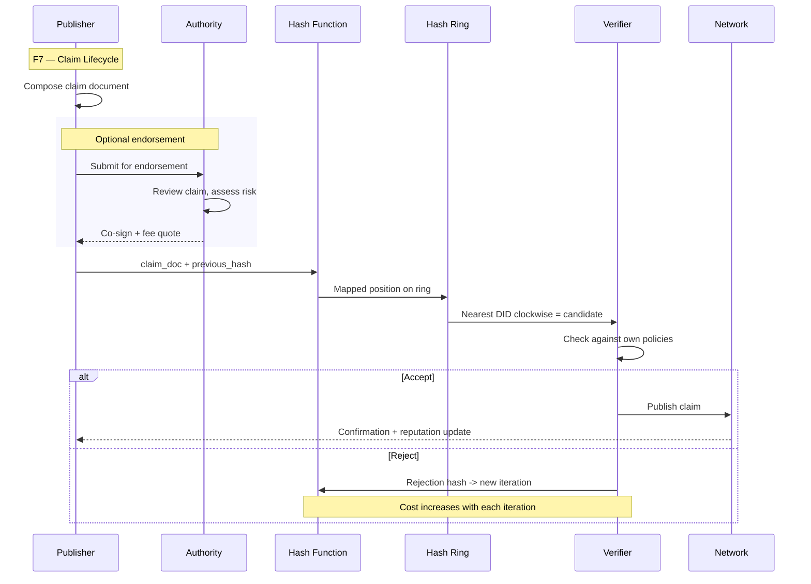
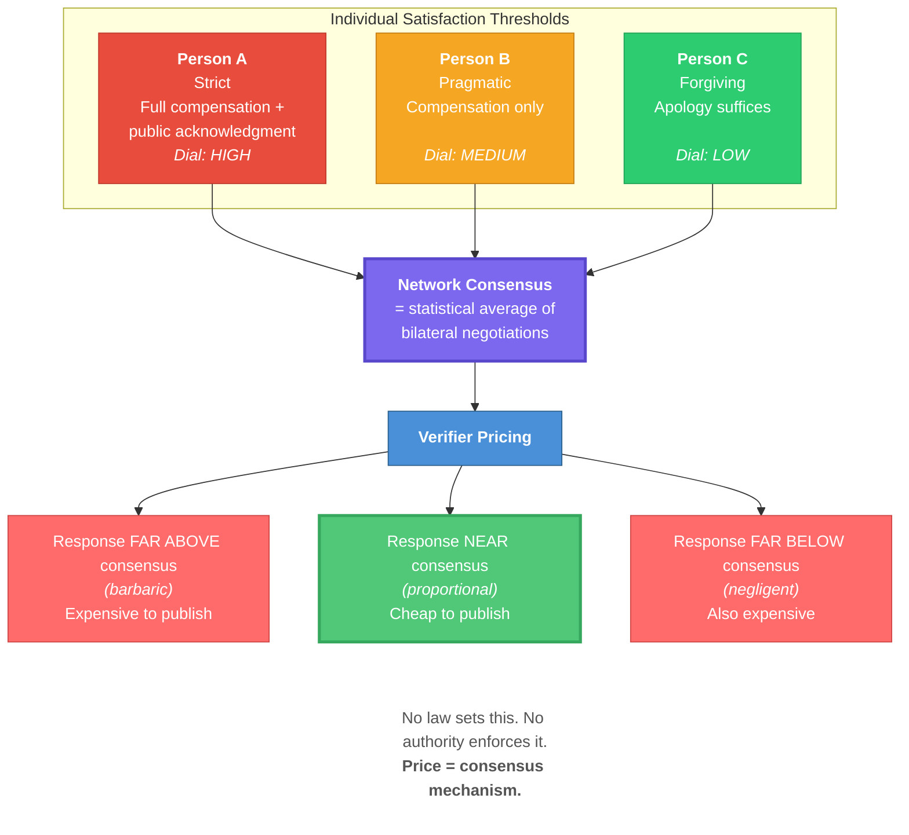
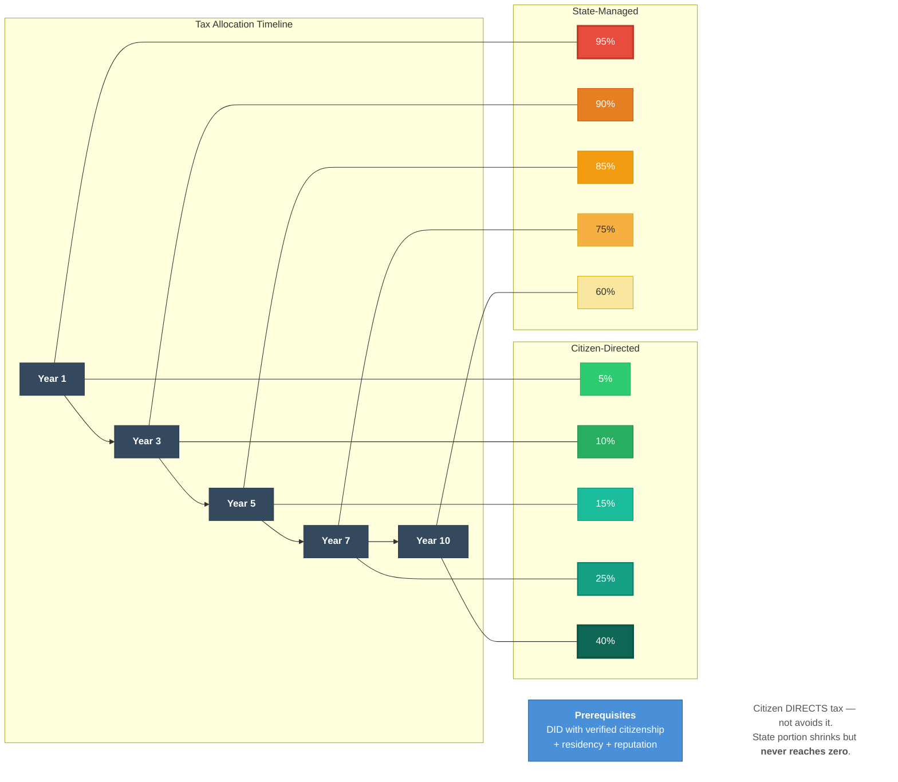

# Whitepaper — Extra Figures (F7, F8, F9)

---

## Figure 7: Claim Lifecycle (Section 4.3)

---

## Figure 8: Emergent Consensus — Satisfaction Averaging (Section 7.2)

---

## Figure 9: Citizen Tax Allocation Over Time (Section 8.3)

