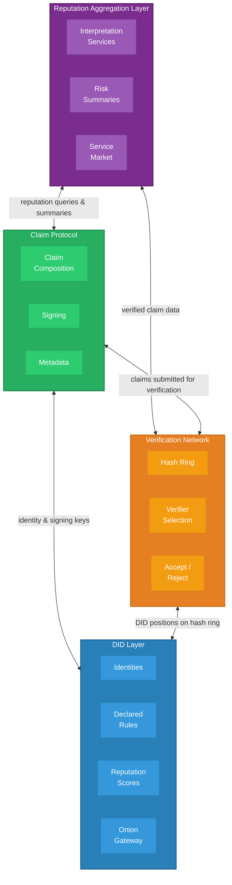
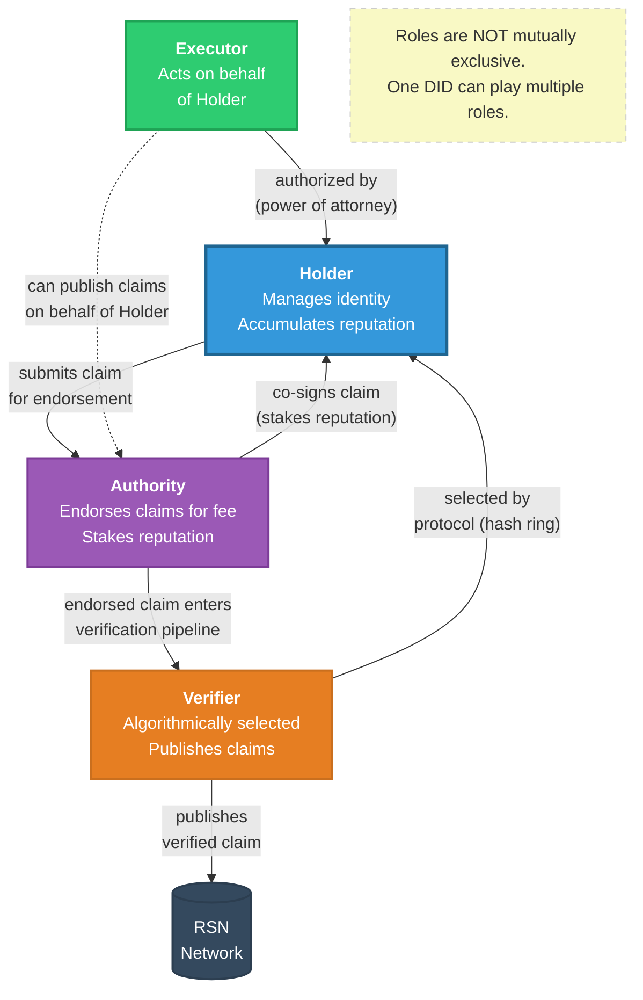
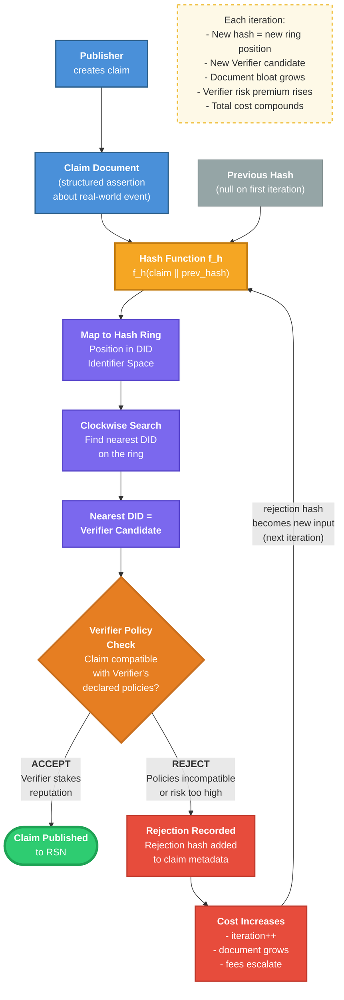
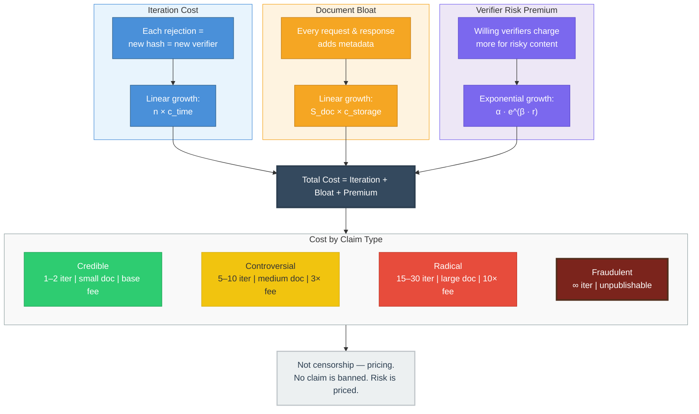
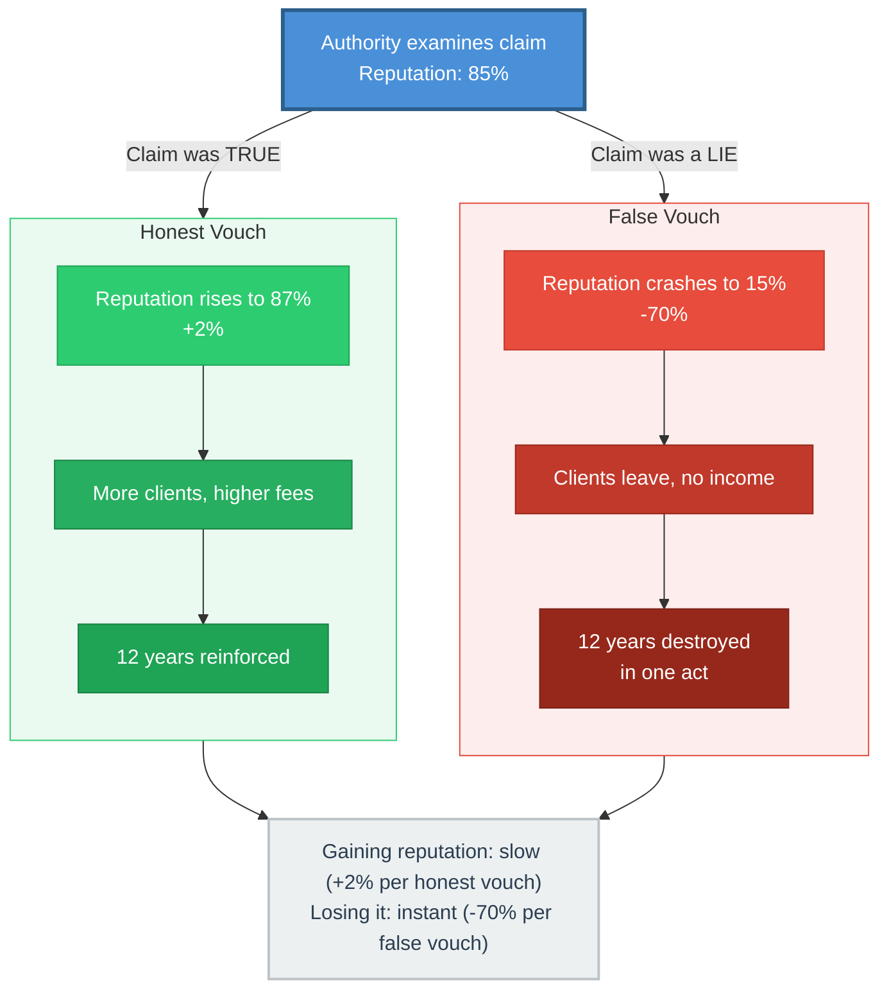
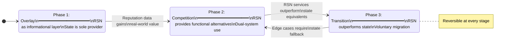

# Whitepaper Figures — Mermaid Diagrams

---

## Figure 1: RSN Architecture (Section 3.2)

Four-layer architecture of the Reputation Social Network showing component hierarchy and inter-layer communication.

---

## Figure 2: Four DID Roles (Section 4.2)

Interaction model between the four DID roles. Roles are not mutually exclusive -- a single DID can play multiple roles simultaneously.

---

## Figure 3: Verifier Selection Protocol (Section 5.2)

Detailed flowchart of the nondeterministic verifier selection protocol based on consistent hashing. This is the core mechanism that prices radical claims through escalating iteration costs.

---

## Figure 4: Expensive Radicalism — Cost Escalation (Section 5.4)

Three cost channels that compound to make radical claims expensive — not censored, but priced.

---

## Figure 5: Reputable Authority — Reputation at Stake (Section 6.2)

Authority vouching process with asymmetric consequences: slow gain vs. instant loss.

---

## Figure 6: Migration Phases (Section 9.3)

Three-phase state diagram of voluntary migration from state systems to RSN. Reversible at every stage.

